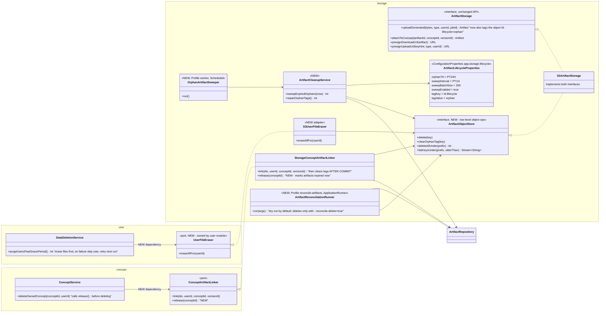
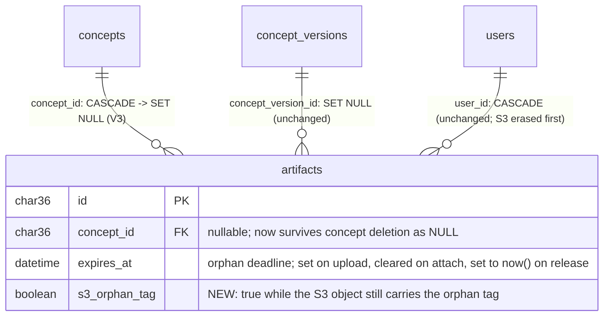
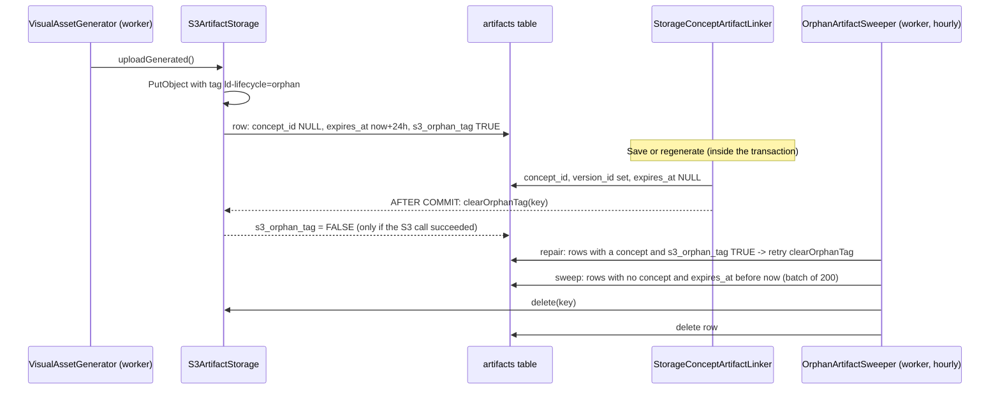

# Design: Enforcing the artifact lifecycle (orphan cleanup + GDPR erasure)

Status: **designed; decisions recorded in §7. Awaiting the user's go-ahead and bucket check. No code written.** 2026-09-27.

## 0. Problem (verified against `learning-dashboard-release-2026-09-27`)

| Claim in docs | Reality in code |
|---|---|
| "Orphan-expiry for abandoned artifacts" (roadmap Phase 1 ✅); "no cleanup code needed" (Phase A+B design) | `expires_at` is written but never read (`findByExpiresAtBefore` has no callers). No scheduled cleanup, no S3 delete call anywhere, no object tags. The "bucket lifecycle policy (see infra/)" is referenced by 3 code comments, but `infra/` doesn't exist. |
| Deleting a concept removes its data | `fk_artifacts_concept ON DELETE CASCADE` removes the **rows**. The S3 objects remain, with nothing left in the database pointing at them. The same happens for "Replace" on a duplicate title. |
| GDPR purge removes everything (`DataDeletionService` comment) | The user row cascade-deletes the artifact rows, but **the S3 images are never deleted**. This is a right-to-erasure gap. |
| Drafts vs saved images are distinguishable in S3 | Both live under `generated/{userId}/`, so a prefix rule can't tell them apart. |

**Decisions already made by the user (2026-09-27):**
- Use **both** mechanisms: the app sweeper is primary; S3 tag + bucket rule is a backstop.
- Fix **GDPR erasure in the same change**.
- Run a **one-off reconcile, dry-run first**, for objects that already leaked.
- The code lives in a **monorepo**.

## 1. Design principles

- **The database is the source of truth.** An S3 object is deleted only when a row says it's an orphan (or, for erasure, when its owner is being purged).
- **Delete the S3 object first, then the row.** A crash between the two leaves a row pointing at a missing object, which the next sweep retries. Deleting an object that's already gone is a no-op in S3, so every step is idempotent.
- **The backstop must never be able to delete a saved image.** Tags are removed after commit and retried until they're confirmed gone; see §4.
- **Ports keep modules apart.** `concept` and `user` don't learn S3 exists. `storage` implements their ports.

## 2. Class diagram



**Why a second storage interface (ISP):** `ArtifactStorage` is what application flows use (upload, attach, presign). Deleting, listing and re-tagging are maintenance operations used only by cleanup code, so they sit on their own interface and pipelines never see them. One S3 class implements both.

## 3. Schema change: `V3__artifact_lifecycle.sql`



```sql
-- V3 (new file; V1/V2 are never edited - Flyway checksums)
ALTER TABLE artifacts DROP FOREIGN KEY fk_artifacts_concept;
ALTER TABLE artifacts ADD CONSTRAINT fk_artifacts_concept
    FOREIGN KEY (concept_id) REFERENCES concepts(id) ON DELETE SET NULL;
ALTER TABLE artifacts ADD COLUMN s3_orphan_tag BOOLEAN NOT NULL DEFAULT FALSE; -- existing objects were never tagged
CREATE INDEX idx_artifacts_orphan_sweep ON artifacts(concept_id, expires_at);
CREATE INDEX idx_artifacts_tag_repair ON artifacts(s3_orphan_tag);
```

**The rule the sweeper applies:** an artifact is an orphan when it has no concept **and** its `expires_at` has passed. Uploads always set `expires_at`. Deleting a concept first sets `expires_at = now()` via `release()`, then `SET NULL` clears `concept_id`. As a safety net, the sweeper also treats "no concept **and** no `expires_at`" as an orphan. Only a delete path that was missed could produce that state, and this catches it.

## 4. Flows



- **Why this makes the backstop safe:** a saved image loses its tag after commit. If that call fails, `s3_orphan_tag` stays TRUE and the hourly repair pass retries it. The bucket rule only acts after **7 days**, so a saved image is at risk only if the sweeper is down for a week *and* its untag call failed. That window is configurable (question below).
- **Concept delete, and "Replace":** `ConceptService.deleteOwnedConcept` → `linker.release(conceptId)` (sets `expires_at = now()`) → delete the concept → FK `SET NULL` → the next sweep collects the orphans.
- **Account purge (GDPR):** for each user past the grace period, `UserFileEraser.eraseAllFor(userId)` deletes everything under `generated/{userId}/` and `uploads/{userId}/` in batches of 1,000. Only then is the user row deleted. If S3 fails, that user is **skipped and retried the next night**, so the row is never removed while files remain.
- **One-off reconcile:** `SPRING_PROFILES_ACTIVE=reconcile-artifacts` lists `generated/` keys **older than 24h** that have no artifact row (the age guard protects in-flight uploads). It prints a report and exits. Only `--reconcile.delete=true` deletes anything.

## 5. Backstop bucket rule (config file, applied by you once)

`learning-dashboard-backend/docs/infra/s3-lifecycle.json`, applied with `aws s3api put-bucket-lifecycle-configuration`:

```json
{ "Rules": [ { "ID": "ld-orphan-backstop", "Status": "Enabled",
  "Filter": { "Tag": { "Key": "ld-lifecycle", "Value": "orphan" } },
  "Expiration": { "Days": 7 } } ] }
```

- **This replaces your bucket's whole lifecycle configuration.** Check the current one first; the instructions will say so.
- **IAM:** the app role needs `s3:PutObjectTagging`, `s3:DeleteObject` and `s3:ListBucket` on the bucket.

## 6. Also in this change

- **Config:**
  - Move the hard-coded `ORPHAN_TTL` (24h) to `ArtifactLifecycleProperties`.
  - Derive the draft save limit (`JobConceptDraftSource`) as `orphanTtl − 1h` instead of a separate hard-coded 23h, so the two can't drift apart.
- **Comments:** fix the 3 code comments that point to the non-existent `infra/`. The V2 migration comment stays untouched (changing it would break Flyway's checksum); the docs will note it's outdated.
- **Tests:**
  - `ArtifactCleanupServiceTest`: orphan rule, the delete ordering, idempotency, batching, tag repair.
  - `DataDeletionServiceTest`: files are erased before the row; S3 failure means the user is skipped.
  - Linker tests: release, and the after-commit untag.
- **Docs:** fix the roadmap's Phase 1 status (orphan expiry was ❌ in practice), the debt list, and diagrams 1.11/1.3/ER, plus a new `VERIFY_ARTIFACT_LIFECYCLE.md`.
- **CI (monorepo):** move both workflows to the repo-root `.github/workflows/`, each with a `working-directory` and a `paths` filter for its own folder.

## 7. Decisions (user, 2026-09-27)

| Question | Answer |
|---|---|
| Mechanism | **Both**: app sweeper (primary) + S3 tag and bucket rule (backstop) |
| GDPR erasure | **In this change** |
| Already-leaked objects | **One-off reconcile, dry-run first** |
| Repo layout | **Monorepo with `backend/` and `frontend/`**. Move both workflows to root `.github/workflows/`: `backend-ci.yml` keeps `working-directory: backend` and gets a `paths: backend/**` filter; `frontend-ci.yml` gets `working-directory: frontend`, a `paths: frontend/**` filter, and the npm cache keyed on `frontend/package-lock.json` |
| Backstop expiry | **7 days** |
| `AccountPurgeJob` | **Worker only** (`@Profile("worker")`) |
| Extras (the 3 repository couplings, `presignUploadUrl`, `.github/modernize`) | **Not in this change.** Written up as T1–T5 in `docs/TECH_DEBT_TASKS.md` for a later chat |

**Still needed before code:** (1) the user's explicit go-ahead on this design; (2) the output of `aws s3api get-bucket-lifecycle-configuration --bucket <bucket>`, because an existing rule on `generated/` would already be deleting saved images, and `put-bucket-lifecycle-configuration` replaces the whole configuration.
