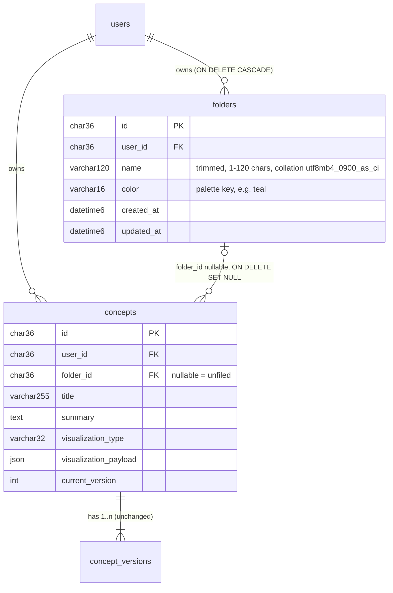
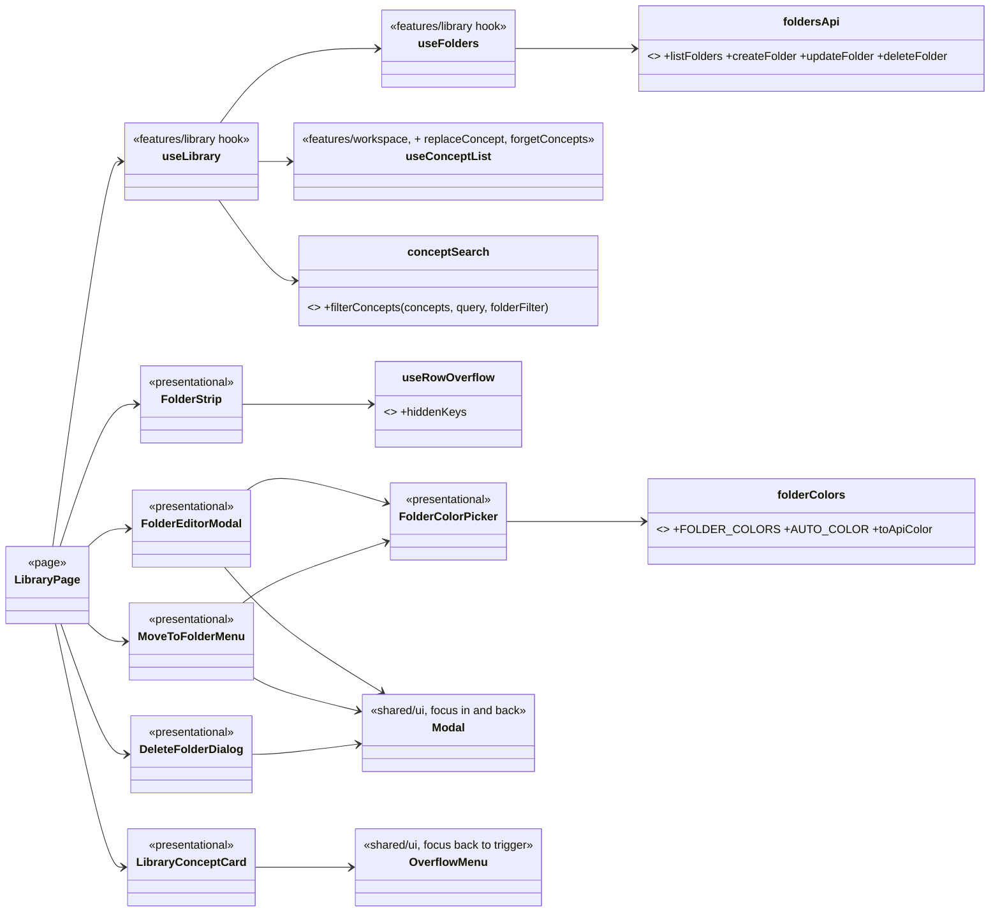

# Design: Folders as real entities + Library redesign (Phase 7)

Status: **implemented** on `feature/phase-7-folders` (2026-09-28). Diagrams below are as built; the user approved the design, then three follow-up changes (see "Decisions").

## Decisions (user, 2026-09-28)

| Question | Decision |
|---|---|
| Module | New `folder` module. `concept` stores only `folder_id` and reaches folders through ports it owns; it never imports `folder`. |
| Filing at capture | Automatic: the AI's suggestion (or the save request's `folder` override) is matched case-insensitively to an existing folder, or a new one is created. No Capture UI change. |
| Colour | Auto-assigned (least-used palette key) unless picked; changeable in the Library. Stored as a palette key, never hex. |
| Name rules | Unique per user, case-insensitive, accent-sensitive (`utf8mb4_0900_as_ci`, explicit on the column). The backfill merges case variants, keeping the spelling most concepts use (tie: earliest). |
| Existing API | Unchanged: `GET /api/concepts?folder=`, `/spark-feed?folder=`, `GET /api/concepts/folders` (names of non-empty folders only), and `ConceptResponse.folder` (name, `""` when unfiled). Added: `folderId`, `folderColor`. |
| Move | `PUT /api/concepts/{id}/folder`; the rename `PATCH` is untouched. |
| Delete a folder | The user chooses: keep the concepts (unfiled) or delete them too. `DELETE /api/folders/{id}?concepts=unfile|delete`, parameter **required** (400 otherwise). |
| Search | Client-side over the loaded list: title + summary, case- and accent-insensitive. No server call, no AI. |
| Startup cycle | One adapter per port (`FolderAssignerAdapter`, `FolderLookupAdapter`), because a combined adapter would form a constructor cycle through `FolderService` → `ConceptService`. |
| UI | Desktop folder row is one line with "N more" to expand; `+` creates a folder (also inside the move dialog, with a colour picker); shared `Modal`/`OverflowMenu` now move and return keyboard focus. |
| Migration | `V3__folders.sql` (the parked artifact-lifecycle migration becomes V4). The old `concepts.folder` column is dropped in V3, after a guard. |

## ER

## Backend classes

```mermaid
classDiagram
    direction LR
    namespace concept {
        class Concept {
            -folderId: UUID "null = unfiled"
            +moveToFolder(folderId)
        }
        class FolderAssigner {
            <<interface, port>>
            +findOrCreate(userId, name) Optional~UUID~
        }
        class FolderLookup {
            <<interface, port>>
            +findIdByName(userId, name) Optional~UUID~
            +isOwnedBy(folderId, userId) boolean
        }
        class ConceptFolderStats {
            <<interface, published>>
            +countByFolder(userId) Map~UUID, Long~
        }
        class ConceptFolderContents {
            <<interface, published>>
            +deleteAllInFolder(userId, folderId) int
        }
        class ConceptFolderStatsQuery
        class ConceptService {
            +listForUser(userId, folderName)
            +randomSparkFeed(userId, folderName, excludeIds, limit)
            +moveOwnedConcept(conceptId, userId, folderId) Concept
            +deleteAllInFolder(userId, folderId) int
        }
        class ConceptSaveService {
            -resolveFolderId(userId, draft, override) UUID
        }
    }
    namespace folder {
        class Folder {
            <<entity>>
            -id, userId: UUID
            -name: String
            -color: FolderColor
            +rename(name)
            +recolor(color)
            +normalizeName(raw) String$
        }
        class FolderColor {
            <<enumeration>>
            CORAL
            YELLOW
            TEAL
            SKY
            VIOLET
            ROSE
            GREEN
            SLATE
        }
        class FolderColorConverter
        class FolderRepository {
            <<interface>>
        }
        class FolderColorAssigner {
            <<interface>>
            +nextColor(userId) FolderColor
        }
        class LeastUsedFolderColorAssigner
        class FolderService {
            +createFolder(userId, name, color) Folder
            +renameOrRecolor(folderId, userId, name, color) Folder
            +deleteOwnedFolder(folderId, userId, mode)
            +findOrCreateByName(userId, name) Optional~Folder~
        }
        class FolderQueryService {
            +listForUser(userId) List~FolderSummary~
            +summaryFor(folder) FolderSummary
            +labelsFor(userId) Map~UUID, FolderLabel~
            +labelFor(userId, folderId) Optional~FolderLabel~
            +namesWithConcepts(userId) List~String~
            +findIdByName(userId, name) Optional~UUID~
            +isOwnedBy(folderId, userId) boolean
        }
        class FolderDeletionMode {
            <<enumeration>>
            UNFILE
            DELETE_CONCEPTS
        }
        class FolderAssignerAdapter
        class FolderLookupAdapter
    }
    ConceptSaveService --> FolderAssigner
    ConceptService --> FolderLookup
    ConceptFolderContents <|.. ConceptService
    ConceptFolderStats <|.. ConceptFolderStatsQuery
    FolderAssigner <|.. FolderAssignerAdapter
    FolderLookup <|.. FolderLookupAdapter
    FolderAssignerAdapter --> FolderService
    FolderLookupAdapter --> FolderQueryService
    FolderService --> FolderRepository
    FolderService --> FolderColorAssigner
    FolderService --> ConceptFolderContents : DELETE_CONCEPTS only
    FolderService ..> FolderDeletionMode
    FolderColorAssigner <|.. LeastUsedFolderColorAssigner
    LeastUsedFolderColorAssigner --> FolderRepository
    FolderQueryService --> FolderRepository
    FolderQueryService --> ConceptFolderStats : counts
    Folder --> FolderColor
    Folder ..> FolderColorConverter : stored as key
```

`ConceptResponseAssembler` (web) adds each concept's folder label (one folder query per list); `FolderController` (`/api/folders`) and `ConceptFolderController` (move, and the legacy `/api/concepts/folders`) are thin. `GlobalExceptionHandler` maps `DuplicateFolderNameException` → 409 `DUPLICATE_FOLDER_NAME` and `InvalidFolderRequestException` → 400.

## HTTP contract

| Route | Result |
|---|---|
| `GET /api/folders` | `[{id, name, color, conceptCount, createdAt}]`, by name, empty folders included |
| `POST /api/folders` `{name, color?}` | 201; 409 `DUPLICATE_FOLDER_NAME`; 400 blank name or unknown colour |
| `PATCH /api/folders/{id}` `{name?, color?}` | 200; 409 on a name clash; 404 not yours |
| `DELETE /api/folders/{id}?concepts=unfile\|delete` | 204; 400 if `concepts` is missing or wrong; 404 not yours |
| `PUT /api/concepts/{id}/folder` `{folderId \| null}` | 200 `ConceptResponse`; 404 if the concept or folder isn't yours |

## Frontend

## Known limits (accepted)

- A deleted concept's images stay in S3, exactly as for a single concept delete today; the parked artifact-lifecycle work covers both.
- After expanding the folder row, selecting a late folder, then collapsing, that tile is hidden again; the heading above the grid still names the folder.
