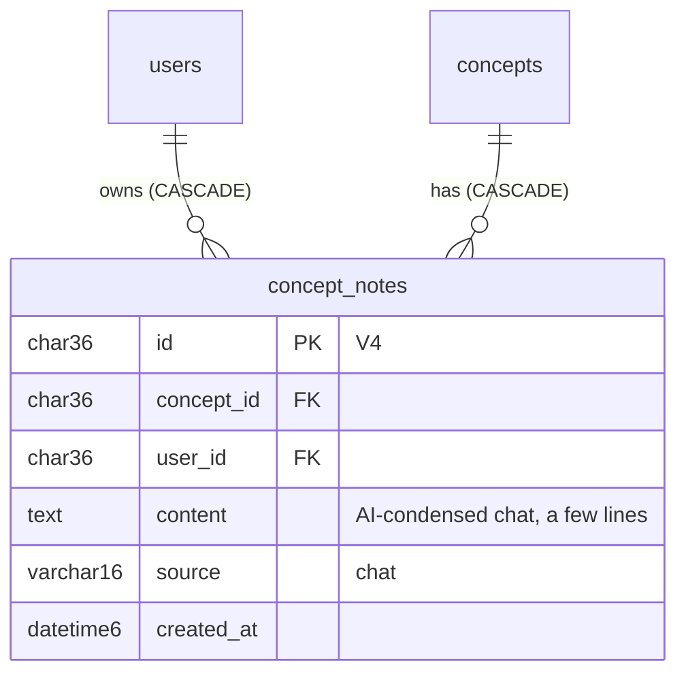
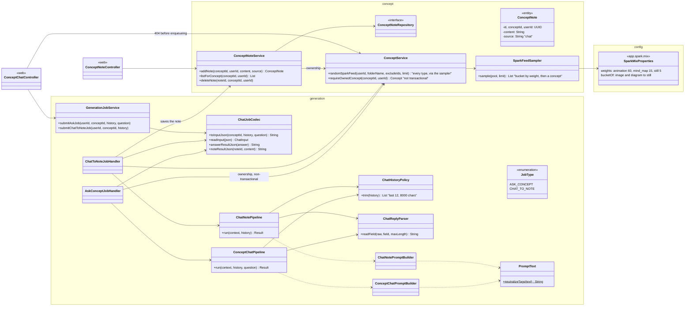
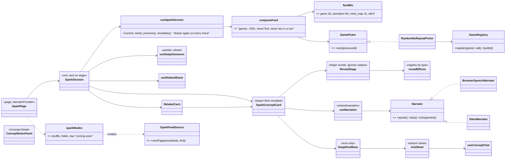

# Design: Spark feed + Ask the AI + Notes (Phase 8)

Status: **implemented** on `feature/phase-8-spark` (2026-09-29). The UI was locked on a mock first (step 1), then the backend (step 2), then wired and checked against the real contract (step 3). Diagrams below are as built.

## Decisions (user, 2026-09-28/29)

| Question | Decision |
|---|---|
| What a card shows on reveal | Every visual type; the reveal is always animated per type (animation plays, mind map grows, diagram draws, image fades) |
| Feed mix | Games 20%, animations 60%, mind maps 15%, images + diagrams together 5% ("still"). Concept shares applied by the backend (`app.spark.mix`), games by the frontend (`feedMix.js`) |
| Session length | Endless scrolling. *This deliberately changes the vision's "short sessions with a clear end".* |
| Build order | Whole UI locked on a mock first, then real data |
| Voice-over | Foundation now: a swappable `Narrator` (browser voice today). **Real AI voice moves to the last phase** |
| Mini-games | Keep both, restyled, as placeholders; a `GameRegistry` + `GamePicker` strategy so new games are one file + one line. Each game shows its own Skip/Continue; `ownsGestures` opts a drag-based game out of feed swipes |
| Deep dive | Icon-only: open in Library, ask the AI |
| Ask the AI | Normal chat in a bottom sheet; not saved unless the user chooses "Save as note" (AI-condensed, shown under Notes on Concept Detail) or "Make a visual" (opens Capture pre-filled; a new concept, linked by Related Concepts) |
| Chat limits | No cap on questions; a shared "ask" rate limit of 20/min; the prompt uses the last 12 messages / 8,000 chars |
| Due for review | Visible mode that says "coming soon" until Phase 9 |
| Reveal on return | Teaser again every time a card is left (recall practice) |
| Swipes vs scrolling | The revealed visual scrolls by finger and ignores swipes; swipe on the card's header/footer (or anywhere on a teaser) |
| Weighting code | A small `SparkFeedSampler` + weights in `application.yml` |
| Prompt safety | Chat text has `<` and `>` neutralized, so a message can't close the prompt's tags |
| Migration | `V4__concept_notes.sql` (the parked lifecycle migration moves to V5) |

## ER

## Backend classes

The api process never calls an AI provider: both chat routes enqueue a worker job and return 202. Ownership is checked before enqueueing (404 at once for a concept that isn't yours), and again in the worker through the non-transactional `requireOwnedConcept`, so a concept deleted mid-chat fails its job cleanly instead of hitting the rollback-only trap (handoff §4.1). `ConceptNoteService` is deliberately not `@Transactional` for the same reason.

## HTTP contract

| Route | Result |
|---|---|
| `GET /api/concepts/spark-feed?folder=&excludeIds=&limit=` | Unchanged contract; now every visual type, in the configured mix |
| `POST /api/concepts/{id}/ask` `{history: [{role, text}], question}` | 202 job; its `resultPayload` is `{kind: "ANSWER", answer}`. 400: blank or >1,000-char question, a role other than user/assistant, >200 messages. 404: not your concept. 429: rate limit |
| `POST /api/concepts/{id}/notes/from-chat` `{history}` | 202 job; `resultPayload` `{kind: "NOTE", noteId, content}`. Same 400/404/429 rules; history must not be empty |
| `GET /api/concepts/{id}/notes` | `[{id, content, source, createdAt}]`, newest first; 404 not your concept |
| `DELETE /api/concepts/{id}/notes/{noteId}` | 204; 404 if the note or concept isn't yours |

## Frontend

## Known limits (accepted)

- A visual taller than the card is scrolled by finger; "Open in Library" shows it whole.
- "Related concepts" links a chat-made visual to its origin only if their texts are close enough (the Phase 6 distance cut-off); there's no explicit link table yet (fits Phase 12).
- The browser voice sounds robotic and varies by device; the AI voice is the last phase.
- Each chat question is stored in `generation_jobs` like every job (audit trail); nothing is attached to the concept unless saved.
