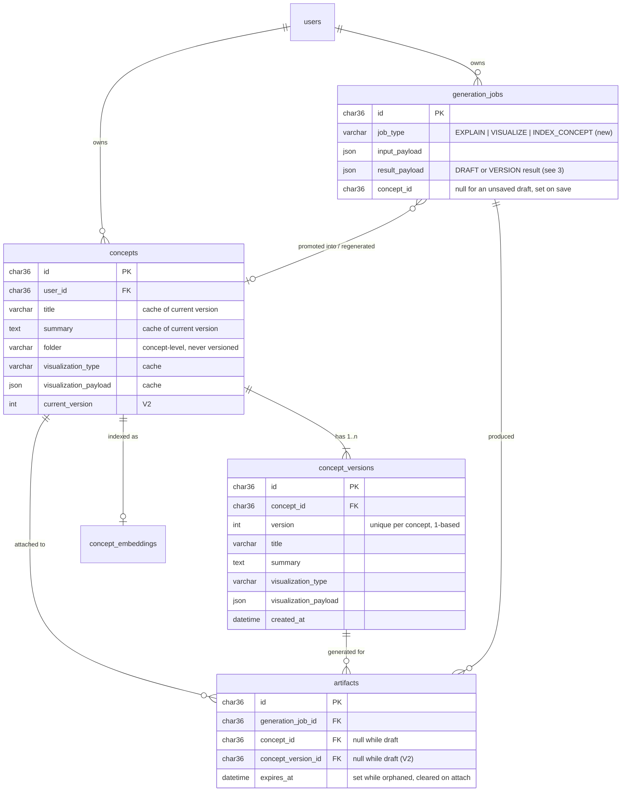
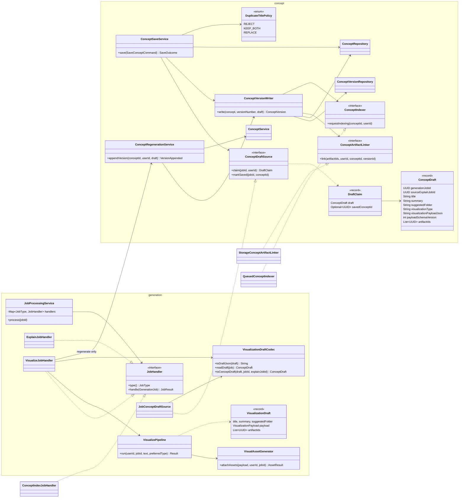
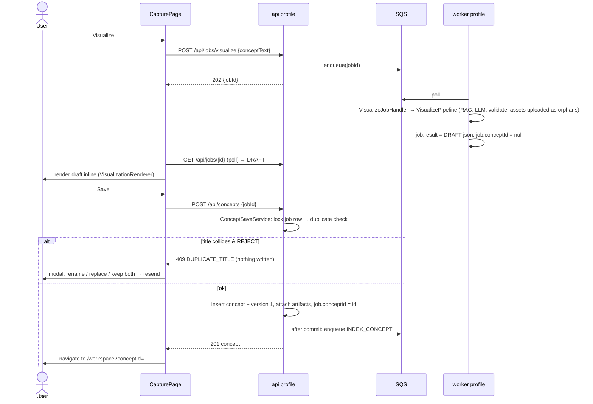
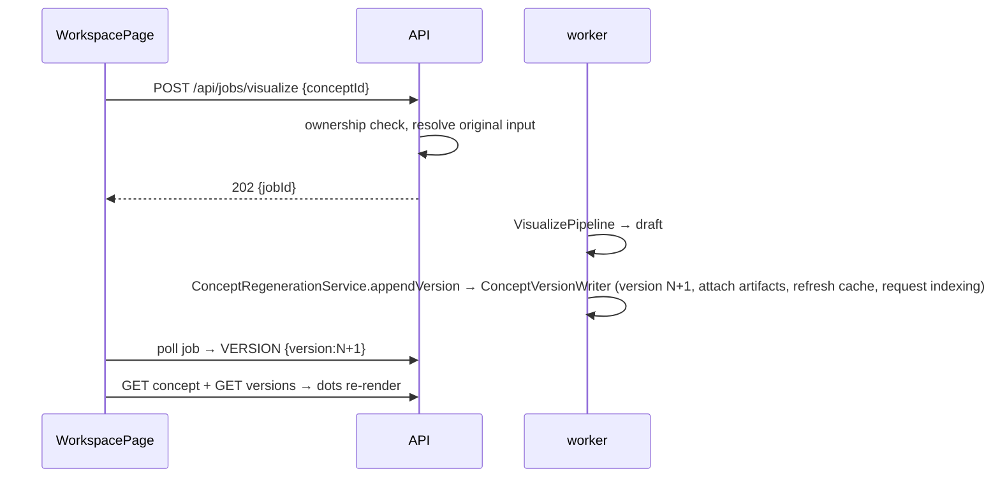
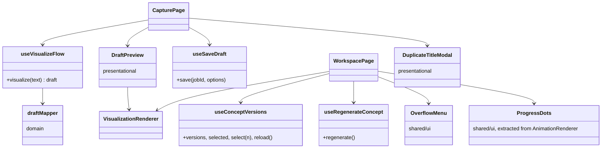

# Design: Draft → Confirm-Save + Concept Versioning (Phase A + B)

Status: **implemented** (see "File map" at the bottom). This doc was written before the code, per the "design before code" standard in `CODEBASE_BASELINE.md`.

---

## 0. Goals and non-goals

**Goals**
1. A Visualize job produces a **draft**, not a saved concept. Nothing is written to `concepts` until the user clicks **Save**.
2. `POST /api/concepts` (confirm-save) promotes a draft into `concepts` + `concept_versions`, runs the duplicate-title check *before* writing, attaches artifacts, and triggers embedding indexing.
3. Post-save **Regenerate** (`POST /api/jobs/visualize` with `conceptId`) appends a real new version.
4. Capture shows the draft inline with Save / Regenerate / Discard. Concept Detail gets a ⋯ menu and version dots.

**Non-goals (unchanged, deliberately left alone)**
- Explain flow, auth, rate limiting, providers, RAG retrieval, Spark, Library, account/GDPR: all untouched.
- No new "drafts" table. The job row *is* the draft (Handoff Part 5).

---

## 1. Schema

Item 1 of the request (`concept_versions`, `concepts.current_version`, `artifacts.concept_version_id`) **already exists** as `V2__concept_versioning.sql` with its entities, and the backfill is already written. It is kept exactly as is. **No new migration is needed.** New job type values fit the existing `generation_jobs.job_type VARCHAR(32)`.



---

## 2. Class diagram

Dependency rule: **arrows point toward interfaces a module owns**. The `concept` module depends on nothing in `generation`, `storage` or `rag`. It declares three small ports, and the other modules implement them (Dependency Inversion).



### Why each class exists (SOLID)

| Class | Single responsibility | Principle it serves |
|---|---|---|
| `VisualizePipeline` | Turn text into a validated `VisualizationDraft`. **Persists nothing.** | SRP. Dependencies drop from 10 to 6, and it no longer depends on `concept` |
| `VisualAssetGenerator` | Generate + upload the image/scene assets a payload asks for (unattached, orphan TTL) | SRP. Extracted from the pipeline unchanged |
| `JobHandler` + registry in `JobProcessingService` | One handler per job type. The service keeps only lifecycle/failure bookkeeping | OCP: a new job type is a new class, with no `switch` to edit |
| `VisualizeJobHandler` | Choose *what to do* with a draft: store it as the job result (new) or append a version (regenerate) | SRP. Keeps the decision out of the pipeline |
| `VisualizationDraftCodec` | The **only** place that knows the draft JSON shape on `result_payload` | SRP / DRY. Written by the handler, read by the draft source |
| `ConceptDraftSource` (port) + `JobConceptDraftSource` | "Give me a saveable draft for this job, locked." The concept module never sees `GenerationJob` | DIP + ISP |
| `ConceptArtifactLinker` (port) + `StorageConceptArtifactLinker` | Attach artifacts to a concept version | DIP. The concept module doesn't know S3/artifact tables exist |
| `ConceptIndexer` (port) + `QueuedConceptIndexer` | "Make sure this concept gets (re-)embedded." Implemented by enqueueing an `INDEX_CONCEPT` job **after commit** | DIP. Also keeps the `api` process free of LLM/embedding calls (Handoff Part 4) |
| `ConceptVersionWriter` | Write one version: version row → link artifacts → refresh concept cache → request indexing | SRP, shared by save and regenerate so the two paths can't drift |
| `ConceptSaveService` | Confirm-save orchestration: idempotency, duplicate policy, create concept + v1, mark job saved | SRP |
| `ConceptRegenerationService` | Append version N+1 to an owned concept | SRP |
| `ConceptIndexJobHandler` (rag) | Worker side of indexing: load concept, embed, upsert | OCP (just another `JobHandler`) |

---

## 3. `result_payload` shapes (owned by `VisualizationDraftCodec`)

**New-concept Visualize job → DRAFT**
```json
{
  "kind": "DRAFT",
  "title": "The Zeigarnik effect",
  "summary": "…",
  "suggestedFolder": "Psychology",
  "visualizationType": "mind_map",
  "visualization": { "type": "mind_map", "version": 1, "...": "..." },
  "artifactIds": ["…uuid…"]
}
```
`job.conceptId` stays `null` until the draft is saved. Then it's set to the new concept's id, which also makes Save idempotent.

**Regenerate Visualize job (`conceptId` in input) → VERSION** (same keys as before, plus `kind`)
```json
{ "kind": "VERSION", "version": 3, "duplicateTitleConceptId": "…optional…" }
```
`job.conceptId` = the regenerated concept (unchanged behavior).

---

## 4. HTTP contract

### `POST /api/concepts` (new, confirm-save)
Request:
```json
{ "jobId": "uuid", "title": "optional override (rename)", "folder": "optional override", "onDuplicate": "REJECT | KEEP_BOTH | REPLACE" }
```
`onDuplicate` defaults to `REJECT`.

| Outcome | Status | Body |
|---|---|---|
| Saved | `201` | `ConceptResponse` |
| Draft already saved (double click, retry) | `200` | the already-saved `ConceptResponse` |
| Title collides and `onDuplicate=REJECT` | `409` | `{ "error", "code": "DUPLICATE_TITLE", "duplicateConceptId", "title" }` (**nothing written**) |
| Job isn't a completed draft (still running, failed, is a regenerate job) | `409` | `{ "error", "code": "DRAFT_NOT_READY" }` |
| Draft older than 23h (its assets' 24h orphan TTL is about to expire) | `410` | `{ "error", "code": "DRAFT_EXPIRED" }` |
| Not the caller's job / doesn't exist | `404` | `{ "error": "Not found." }` |

The duplicate modal's three choices map to: **Rename** → resend with `title`, **Replace** → resend with `onDuplicate=REPLACE` (the old concept is deleted in the *same* transaction, after the new one is written), **Keep both** → resend with `onDuplicate=KEEP_BOTH`.

### `POST /api/jobs/visualize` (existing, extended)
- Without `conceptId`: unchanged request. The result is now a DRAFT (see 3).
- With `conceptId` (post-save regenerate): `conceptText` becomes **optional**. When it's omitted, the server re-uses the input of the most recent Visualize job for that concept (text, preferred type, explain-job link). If there isn't one (a very old concept), it falls back to `title + summary`. `preferredVisualizationType` omitted → the original job's choice.

### Unchanged, already existed
`GET /api/concepts/{id}/versions`, `GET /api/concepts/{id}/versions/{version}`, `GET /api/jobs/{id}`, `GET /api/artifacts/{id}` (already scoped by owner only, so draft images render before save).

---

## 5. Sequences

### 5a. Capture: visualize → draft → save

**Regenerate (pre-save)** = submit the same text again and replace the draft on screen. **Discard** = clear local state. The abandoned draft's artifacts keep their 24h orphan expiry, so no cleanup code is needed.

### 5b. Concept Detail: post-save regenerate


---

## 6. Frontend structure



- `ProgressDots` is the animation renderer's scene-dot markup and CSS classes (`animation-progress`, `animation-dot`, `active`), extracted so it produces **identical DOM**. The animation renderer and the version switcher both use it.
- Dots are hidden unless `currentVersion > 1`.
- `useConceptVersions` loads the list lazily only when there's more than one version, and fetches a historical version's payload only when its dot is clicked.

---

## 7. Behavior changes (intentional) versus preserved

| Area | Before | After |
|---|---|---|
| New Visualize | Saved a concept immediately, embedded inline in the worker | Returns a DRAFT, and saving is explicit. Embedding runs as an async `INDEX_CONCEPT` job after save |
| Duplicate title | Detected after save. "Replace" deleted the old concept, "rename" renamed the new one | Detected on Save **before** any write, with the same three choices |
| Regenerate via API | Appended a version and embedded inline | Still appends a version. Embedding moves to the async index job, and `conceptText` is optional |
| Everything else | — | Unchanged |

---

## 8. File map

**Backend: new**
`concept/ConceptDraft`, `concept/DraftClaim`, `concept/ConceptDraftSource`, `concept/ConceptArtifactLinker`, `concept/ConceptIndexer`, `concept/ConceptVersionWriter`, `concept/ConceptSaveService`, `concept/SaveConceptCommand`, `concept/SaveOutcome`, `concept/ConceptRegenerationService`, `concept/VersionAppended`, `concept/DuplicateTitlePolicy`, `concept/DuplicateTitleException`, `concept/DraftNotSaveableException`, `generation/model/VisualizationDraft`, `generation/pipeline/VisualAssetGenerator`, `generation/job/JobHandler`, `generation/job/JobResult`, `generation/job/ExplainJobHandler`, `generation/job/VisualizeJobHandler`, `generation/job/VisualizationDraftCodec`, `generation/job/JobConceptDraftSource`, `storage/StorageConceptArtifactLinker`, `rag/QueuedConceptIndexer`, `rag/ConceptIndexJobHandler`, `web/dto/ConceptSaveRequest`, and tests.

**Backend: changed**
`VisualizePipeline` (no persistence), `JobProcessingService` (registry), `JobType` (+`INDEX_CONCEPT`), `GenerationJob` (+`linkConcept`), `GenerationJobRepository` (+2 queries), `GenerationJobService` (+index/regenerate submit), `ConceptController` (+`POST`), `VisualizeController` + `VisualizeRequest` (optional text on regenerate), `GlobalExceptionHandler` (+2 mappings), `application.yml` (embedding model default fix).

**Frontend: new**
`api/conceptsApi` (+`saveConcept`, `listConceptVersions`, `getConceptVersion`), `api/jobsApi` (+`submitRegenerateJob`), `domain/draftMapper`, `features/capture/{hooks/useSaveDraft, components/DraftPreview, components/DuplicateTitleModal}`, `features/workspace/hooks/{useConceptVersions,useRegenerateConcept}`, `shared/ui/{ProgressDots,OverflowMenu}`, `shared/constants/visualizationTypes`.

**Frontend: changed**
`CapturePage`, `WorkspacePage`, `useVisualizeFlow` (returns the mapped draft), `AnimationRenderer` (uses `ProgressDots`, same DOM), `conceptMapper` (+`currentVersion`), `index.css` (draft + overflow styles).
