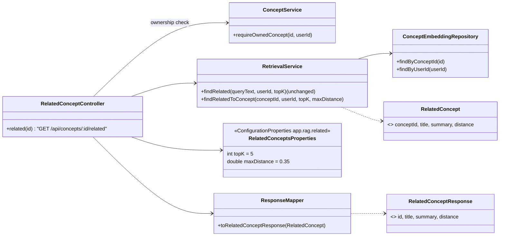
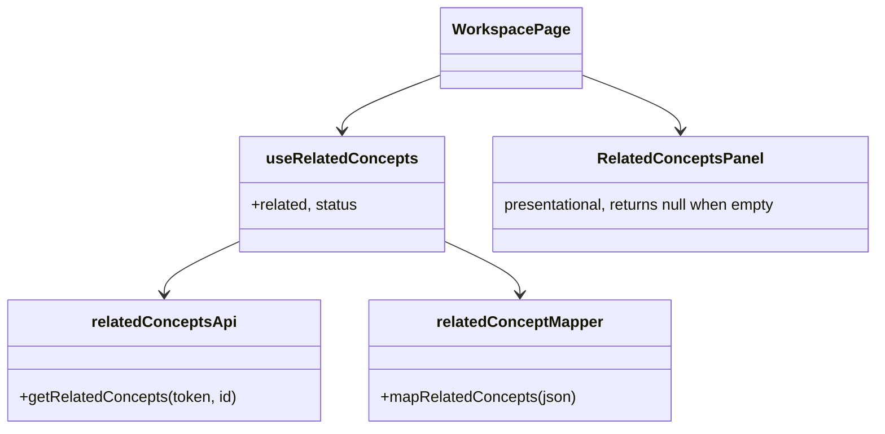

# Design: RAG as a user-facing feature ("Related concepts", Phase F)

Written before the code, per the "design before code" standard. Status: **implemented**.

## 0. Product claim being tested

Handoff Part 1: *"When saving something new, quietly connect it to related things already saved, even across folders (a new 'back muscles' concept links to a 'posture' concept saved months earlier)."*

Surfacing rows isn't enough to test this. The claim holds only if the rows shown are **actually related**, and if **nothing** is shown when nothing is. That is why this design adds a relevance cut-off and a calibration step (section 5).

## 1. Two deliberate deviations from the brief, and why

| Brief | Implemented | Reason |
|---|---|---|
| Call `RetrievalService.findRelated(title + summary, …)` | New `RetrievalService.findRelatedToConcept(conceptId, …)`, which uses the concept's **stored** embedding as the query vector | `findRelated` calls the embedding provider on every request. On a page view that (a) breaks the architecture rule that the api process never calls an AI provider (Handoff Part 4), (b) adds seconds of latency and a free-tier quota hit each time the page opens, and (c) exposes the page to Gemini's 503 "high demand" errors. The stored vector is already `embed(title + ". " + summary)` (see `EmbeddingIndexService`), which is exactly the query the brief describes, so the results are identical at zero provider calls. `findRelated` is untouched and still serves generation. |
| Top-k = 5 | Top-k = 5 **and** a maximum cosine distance (default `0.35`), both configurable | Without a cut-off, "related" just means "nearest", so a library of three unrelated concepts would still show all three as related. The default is a starting point that the Step 5 script calibrates on real Gemini vectors. |

Both values are env-configurable: `RELATED_TOP_K`, `RELATED_MAX_DISTANCE`.

## 2. Class diagram

- **A new controller rather than growing `ConceptController`** (SRP). Spring routes the literal `/{id}/related` path alongside `ConceptController`'s `/{id}` routes without conflict.
- **No new ports.** This endpoint only reads, entirely within `rag` + `concept`, which already depend on each other in this direction (`RetrievalService` → `ConceptRepository`).

## 3. Retrieval rules (`findRelatedToConcept`)

1. Load the concept's own embedding. **If it has none yet** (its `INDEX_CONCEPT` job hasn't run, or it failed), return an **empty list**. That hides the panel; it never falls back to calling the provider.
2. Candidates = the user's other embeddings (tenant-scoped). The concept itself is excluded, and vectors of a different dimension (left over from an embedding-model change) are skipped instead of failing the request.
3. Rank by cosine distance, keep `distance ≤ maxDistance`, cap at `topK`.
4. Folders are ignored on purpose: cross-folder links are the point of the feature.

## 4. HTTP contract

`GET /api/concepts/{id}/related` → `200 [ { id, title, summary, distance } ]`, nearest first, possibly `[]`. Returns `404` if the concept doesn't exist or isn't the caller's, the same as every other concept route.

`distance` is included for calibration and debugging. The UI does not display it.

Optional query parameters, used only by the calibration script: `limit` (1–20, default `topK`) and `maxDistance` (0–2, default configured). Out-of-range values are clamped. They can only widen or narrow what the caller already owns, so they expose nothing new.

## 5. Frontend

- The panel renders **nothing** while loading, on error, or when the list is empty: no skeleton and no empty box. Related concepts are a bonus and must never add noise.
- Cards show the title plus a 2-line clamped summary (the anti-goal "every screen should resist more text"). Each card links to `/workspace?conceptId=…`, and Workspace already remounts per concept id.
- The list refetches when the concept's `currentVersion` changes (a regenerate can change title/summary). The re-index happens asynchronously, so it may catch up a moment later.

## 6. Step 5: calibrating the product claim

`scripts/verify-related-concepts.mjs` (in the frontend repo, because it already has Node) takes a token and the ids of concepts you saved from `scripts/related-concepts-fixtures.md`. It prints each concept's related list with distances plus a distance matrix, and checks these expectations:

- *Back muscles* ↔ *Posture* are mutually related (the vision's own example).
- *Core stability* relates to at least one of them.
- The controls (*Sourdough fermentation*, *French Revolution causes*) do **not** appear in the body cluster's lists.

It also suggests a `RELATED_MAX_DISTANCE` halfway between the furthest pair that should be related and the nearest pair that shouldn't. That turns the default threshold into a measured one.
