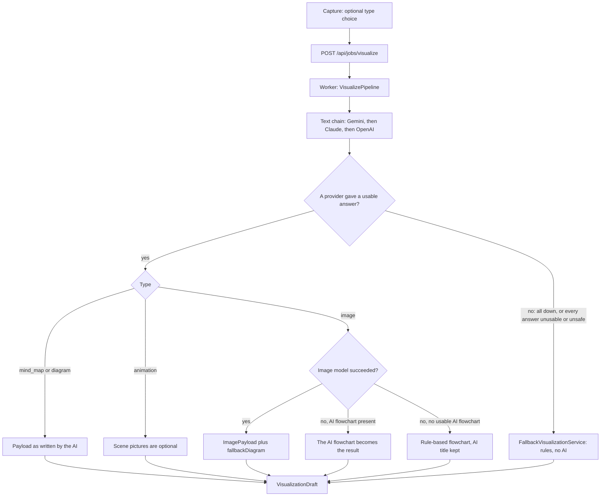
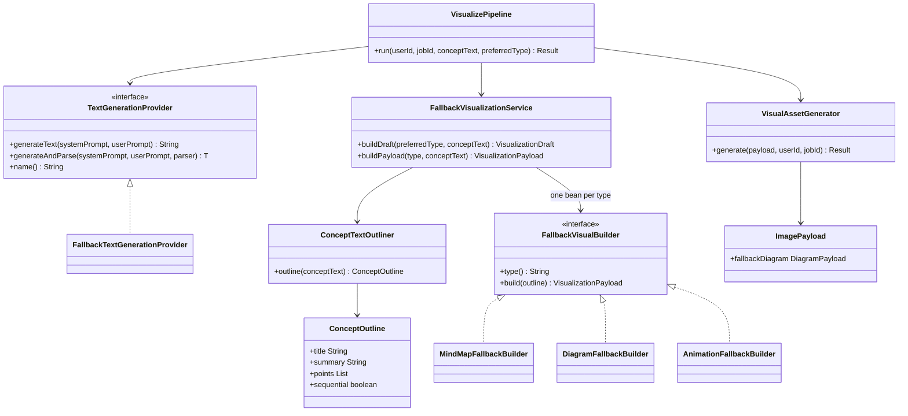

# Design: visual failsafe, two-track generation, Gemini-first providers

**Status: BUILT 2026-10-06.** Frontend verified (lint, build, 43 browser checks against a mocked API). Backend logic verified by compiling the real classes against stubs and running 142 behaviour checks; **the user's `mvn test` is still the real check** (Maven Central is blocked in the assistant's sandbox).

## 1. Decisions (user, 2026-10-06)

| # | Decision |
|---|---|
| D1 | The failsafe triggers on provider outages, unusable AI output (invalid JSON, wrong structure) **and content-safety rejections**. |
| D2 | Two tracks. **Image track:** the LLM decides what to show, the image model draws it. **Structure track:** the LLM returns JSON and **React Flow** renders the mind map / flowchart. |
| D3 | Provider order for everything: **Gemini first** (free), then Claude, then OpenAI. A provider with no API key drops out of the chain at startup. |
| D4 | If the picture cannot be produced, show a React Flow flowchart built **from the AI's JSON**. Only if no AI could be reached at all, build the visual **from the user's own text by rules**. |
| D5 | Mind maps, flowcharts and animations each have their **own builder class** for the rule-based track. |
| D6 | Capture has an optional type picker: **Let AI choose** (default), Mind map, Image / diagram, Animation. |
| D7 | Failsafe output is silent: no badge; it saves, versions and regenerates like any other visual. |
| D8 | Animation scenes keep optional Gemini pictures; a failed picture never fails the animation. |
| D9 | Image results get a **Show as diagram** toggle. |
| D10 | Editing: the foundation is built now (drag, reset, a save hook); persistence is the next phase. |
| D11 | If everything fails, the error goes to the log and the job is marked FAILED as before. |

## 2. The ladder

An unusable answer from one provider (bad JSON, wrong structure, content-safety rejection) counts as that provider failing, so the next provider is asked before the rules are used.

When nobody chose a type ("Let AI choose") and no AI is reachable, the text decides: numbered or "first / then / finally" text becomes an animation, anything else a mind map. A requested image becomes a flowchart.

## 3. Backend

No new table, no migration. The failsafe produces the existing payload types, so save, versions, related concepts and Spark are unchanged.

| File (under `generation/`) | Change |
|---|---|
| `fallback/ConceptOutline`, `ConceptTextOutliner` | **new.** Rule-based reading of the text: title, summary, points in order, headings as groups, "is this a sequence". Strips control characters and markup. |
| `fallback/FallbackVisualBuilder` + `MindMapFallbackBuilder`, `DiagramFallbackBuilder`, `AnimationFallbackBuilder` | **new.** One class per visual type, registered by `type()`. |
| `fallback/FallbackVisualizationService` | **new.** Registry + type resolution. A disallowed term in the user's own title falls back to a neutral title instead of failing. |
| `pipeline/VisualizePipeline` | **changed.** The ladder above. RAG retrieval failure no longer fails the job. |
| `pipeline/VisualAssetGenerator` | **changed.** Image failure returns the AI flowchart; scene-picture failure keeps the scene and stops asking for more pictures. |
| `provider/TextGenerationProvider`, `FallbackTextGenerationProvider` | **changed.** `generateAndParse`: an unusable answer moves on to the next provider. |
| `model/ImagePayload` | **changed.** New nullable `fallbackDiagram`. Old stored concepts read back with `null`. |
| `prompt/VisualizationPromptBuilder`, `validation/VisualPayloadValidator` | **changed.** Image answers carry `fallbackDiagram`; it is validated when present. A malformed one is dropped, not fatal. |
| `config/AiProperties`, `application.yml`, `set-env.example.ps1`, `README.md` | **changed.** Text order defaults to `gemini,claude,openai`. |

New tests: `ConceptTextOutlinerTest`, `FallbackVisualBuildersTest`, `FallbackVisualizationServiceTest`, `VisualAssetGeneratorTest`, `VisualizePipelineTest`; additions to `VisualPayloadValidatorTest`, `VisualizationPromptBuilderTest`.

## 4. Frontend

| File (under `src/`) | Change |
|---|---|
| `package.json` | **+ `@xyflow/react`** (React Flow). The only new dependency. |
| `features/workspace/graph/layout.js` | **new.** Pure layout: radial mind map, layered flowchart, long chains folded into rows, phone-width variants. AI coordinates are ignored. |
| `features/workspace/graph/useEditableGraph.js`, `useCompactCanvas.js`, `GraphCanvas.jsx`, `MindMapNode.jsx`, `DiagramNode.jsx` | **new.** Shared canvas, node shapes, drag / reset state. |
| `renderers/MindMapRenderer.jsx`, `DiagramRenderer.jsx` | **rewritten** on React Flow. Same props as before. |
| `renderers/SceneMotion.jsx` | **new.** The coded scene visual (SVG + CSS, no network). |
| `renderers/AnimationRenderer.jsx` | **changed.** Scenes with no usable picture play `SceneMotion`. |
| `renderers/ImageRenderer.jsx` | **changed.** Automatic flowchart fallback + Show as diagram. |
| `renderers/VisualizationRenderer.jsx` | **changed.** Graph renderers load on demand. |
| `domain/visualizationMappers.js` | **changed.** Maps `fallbackDiagram` and `savedPositions`. |
| `pages/CapturePage.jsx`, `features/capture/hooks/useVisualizeFlow.js`, `shared/constants/visualizationTypes.js` | **changed.** The type picker; Regenerate reuses the choice. |
| `index.css` | **changed.** Styles for all of the above; `prefers-reduced-motion` respected. |
| `scripts/verify-visual-failsafe.py` | **new.** The browser check that was run. |

## 5. Editing: what exists and what the next phase adds

Exists now: nodes drag, the canvas zooms and pans, **Reset layout** restores the computed layout. `useEditableGraph` calls `onLayoutChange(positions)` after every drag, and the mapper already reads `layoutHints.positions` into `savedPositions`, which the layout honours.

Next phase ("Editable visuals"): a `PATCH` endpoint that stores positions as a new concept version, wiring `onLayoutChange` to it, then label editing and adding / removing nodes. Starts with its own design review.

## 6. Limits

1. **A picture that loads but is wrong or unreadable cannot be detected by code.** Show as diagram is the manual answer. An automatic check would need an extra AI vision call per image.
2. **Rule-based visuals are plainer.** They rearrange the user's sentences; they do not summarise or infer.
3. **Storage failure during image upload** can still hit the known worker rollback-only trap (`PROJECT_HANDOFF_V3` §4.1), because `S3ArtifactStorage.uploadGenerated` is `@Transactional`. Image-model failures are not affected. Fixing the trap is the existing opportunistic task.
4. Explain ("Explain this") is unchanged: it still fails if every text provider is down.
