# Architecture Diagrams

Generated by reading the actual backend source tree — not reconstructed
from memory. **Last verified 2026-09-28 against branch `feature/phase-7-folders`
(153 main-source files: 126 before Phase 7, plus 27 for Folders).** Phase 7
regenerated sections 1.4 (ports note), 1.13 (new controllers), 1.14 (the
folder module, now built), 2 (ER) and the use-case legend. If a future change
makes any of this stale, regenerate the affected section rather than hand-edit.

**2026-09-27 re-verification, against the real source tree.** Corrected in
place: 1.2 (two config classes were missing), 1.4 (`applyNewVersion`, two
repository finders), 1.5 (`GenerationJobService` uses `ObjectMapper`, not
`JobJson`; `submitRegenerateJob`; `VisualizeJobHandler` does **not** call
`VisualAssetGenerator`), 1.7 (`VisualizePipeline` calls
`VisualAssetGenerator` itself, 6 dependencies, and the draft carries
`artifactIds`), 1.10 (`findRelatedToConcept`; `ConceptIndexJobHandler` uses
`ConceptRepository`), 1.11 (`conceptVersionId` and the real `attachToConcept`
signatures), 1.13 (`RelatedConceptController`, missing handlers/mapper
methods/dependencies), 1.14 (RAG surfaced is **built**; only Folders remain
planned) and 3 (related concepts make no AI call). The user confirmed three
design decisions on 2026-09-27; they are recorded in 1.7, 1.10 and 1.14.

**What changed since the last verification, and how I know**: the user's
own `docs/design/phase-a-b-draft-save-and-versioning.md` (in the actual
repo) documents the draft/confirm-save + versioning implementation in
detail, and I spot-verified every file it claims exists against the real
source tree — all present, none missing. Sections 1.4–1.7, 1.10–1.11, and
1.13 below are rewritten from that verified reality. Sections 1.1–1.3,
1.6 (provider), 1.9, and 1.12 are **unchanged from the last verification**
— nothing in the diff touched those modules, so they weren't
re-diagrammed.

**Two corrections to the previous version of this document worth stating
plainly**:
1. My "PLANNED" recommendation in the old Section 1.14 for draft/
   confirm-save is **superseded** — the real implementation is more
   sophisticated than what I sketched (a proper `JobHandler` registry
   replacing a switch statement, `VisualizationDraftCodec` as the single
   source of truth for the draft JSON shape, async `INDEX_CONCEPT` job
   instead of inline embedding). Removed; replaced with the verified
   as-built version below.
2. **The roadmap's "Spark feed: 0%" and "Folders: not started" claims
   were wrong.** `GET /api/concepts/spark-feed` and `GET
   /api/concepts/folders` already exist at the backend (see Section
   1.4). *Correction 2026-09-27*: `SparkPage.jsx` is **not** a mockup. It
   plays the user's real saved animation concepts from `spark-feed` with
   infinite scroll, and interleaves two working mini-games
   (`QuickMatchGame`, `TapDashGame`) after every 3 cards. What's missing
   is the Spark design itself (teaser/reveal, gestures, sub-stacks, the three
   modes, audio). Library still has no folder UI.

Render these by opening this file in VS Code (with a Mermaid extension),
GitHub (renders Mermaid natively in `.md` files), or any Mermaid live
editor.

---

## 1. Class Diagrams (13 modules)

### 1.1 Common — cross-cutting exceptions

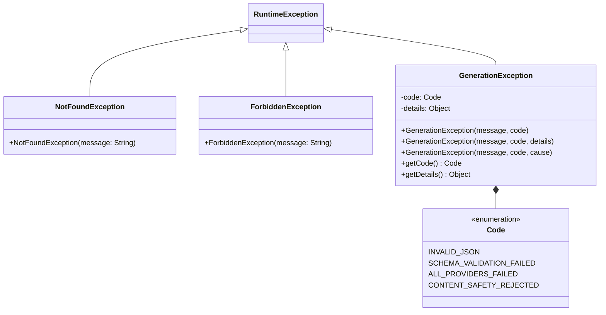

**Note**: `ForbiddenException` exists but is currently unused — ownership
violations are mapped straight to `NotFoundException` (404) at the
service layer instead, for enumeration-safety (see `ConceptService`,
Section 1.4). Flag for cleanup: either wire it in somewhere or remove it.

---

### 1.2 Config — externalized configuration (all `@ConfigurationProperties`)

```mermaid
classDiagram
    class AiProperties {
        -anthropicApiKey: String
        -geminiApiKey: String
        -openaiApiKey: String
        -textProviderOrder: List~String~
        -visualProviderOrder: List~String~
        -embeddingProviderOrder: List~String~
        -claudeModel, geminiTextModel, geminiVisualModel, geminiEmbeddingModel, openaiTextModel: String
        -requestTimeoutMs: long
        -maxRetries: int
        +getters/setters for all above
    }
    class AwsProperties {
        -region: String
        -sqs: Sqs
        -s3: S3
        +getRegion() getSqs() getS3()
    }
    class Sqs {
        -generationQueueUrl, generationDlqUrl: String
        -waitTimeSeconds, visibilityTimeoutSeconds, maxMessagesPerPoll: int
    }
    class S3 {
        -artifactsBucket: String
        -presignTtlMinutes: int
    }
    class ContentSafetyProperties {
        -disallowedTerms: List~String~
    }
    class CorsProperties {
        <<record>>
        +allowedOrigins: List~String~
    }
    class GdprProperties {
        -gracePeriodDays: int
        -purgeEnabled: boolean
    }
    class RateLimitProperties {
        -explain: Endpoint
        -visualize: Endpoint
    }
    class Endpoint {
        -windowSeconds: long
        -maxRequests: int
    }
    class WorkerProperties {
        -pollEnabled: boolean
    }
    class RelatedConceptsProperties {
        <<ConfigurationProperties app.rag.related>>
        -topK: int "default 5, env RELATED_TOP_K"
        -maxDistance: double "default 0.35 cosine distance, env RELATED_MAX_DISTANCE"
    }
    class RequestLoggingConfig {
        <<Configuration - request logging filter setup>>
    }
    class SecurityConfig {
        -provisioningFilter: CognitoUserProvisioningFilter
        -corsProperties: CorsProperties
        +securityFilterChain(HttpSecurity) SecurityFilterChain
        +jwtAuthenticationConverter() JwtAuthenticationConverter
        -corsConfigurationSource() CorsConfigurationSource
    }
    class AwsClientConfig {
        +s3Client(AwsProperties) S3Client
        +s3Presigner(AwsProperties) S3Presigner
        +sqsClient(AwsProperties) SqsClient
    }
    AwsProperties *-- Sqs
    AwsProperties *-- S3
    RateLimitProperties *-- Endpoint
    SecurityConfig --> CorsProperties : uses
```

**Pattern**: every `*Properties` class is the same shape (plain POJO,
env-bound via Spring Boot relaxed binding) — this is a consistent,
repeated convention rather than one class doing config for everything.

---

### 1.3 Security & User — auth, JIT provisioning, GDPR

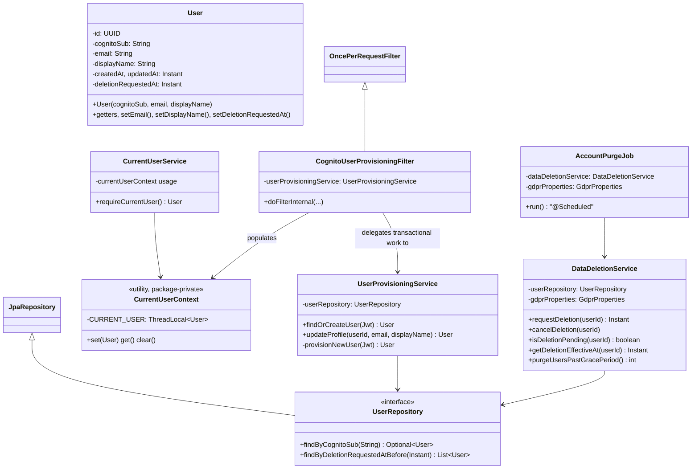

**Design note this diagram makes visible**: `CognitoUserProvisioningFilter`
delegates to `UserProvisioningService` specifically *because* a Servlet
`Filter` can't safely carry `@Transactional` (see the hard-won-lessons
list in the handoff doc — this split exists because of a real production
crash, not by accident). This is a textbook **Single Responsibility**
split: the filter's only job is "run once per request, populate context";
all DB/transaction logic lives in the service.

---

### 1.4 Concept — the core saved-content entity, now with draft/confirm-save + versioning

**Rewritten section** — the concept module went from 3 classes to 18.
Verified against the actual implementation, cross-checked with the
project's own design doc.

```mermaid
classDiagram
    class Concept {
        -id, userId: UUID
        -title, summary, folder: String
        -visualizationType: String
        -visualizationPayload: String "cache of current version"
        -visualizationVersion, currentVersion: int
        -sourceExplainJobId: UUID
        -createdAt, updatedAt: Instant
        +renameTo(newTitle)
        +applyNewVersion(newCurrentVersion, title, summary, visualizationType, visualizationPayload, visualizationVersion) "refreshes the current-version cache; never touches folder"
        +getters for all fields
    }
    class ConceptVersion {
        -id, conceptId: UUID
        -version: int
        -title, summary, visualizationType: String
        -visualizationPayload: String
        -createdAt: Instant
        +finalizeContent(visualizationPayload)
        +getters for all fields
    }
    class ConceptRepository {
        <<interface>>
        "+ findByIdAndUserId, list/folder/spark finders, findFirstByUserIdAndTitleIgnoreCaseAndIdNot, findFirstByUserIdAndTitleIgnoreCase (confirm-save duplicate check), lockByIdAndUserId (PESSIMISTIC_WRITE)"
    }
    class ConceptVersionRepository {
        <<interface, NEW>>
    }
    class ConceptService {
        -conceptRepository, conceptVersionRepository
        +save(Concept) Concept
        +saveVersion(ConceptVersion) ConceptVersion
        +listVersions(conceptId) List~ConceptVersion~
        +requireVersion(conceptId, version) ConceptVersion
        +requireOwnedConcept(conceptId, userId) Concept
        +requireOwnedConceptForUpdate(conceptId, userId) Concept "NEW - pessimistic-lock variant for save/regenerate races"
        +listForUser(userId, folder) List~Concept~
        +deleteOwnedConcept(conceptId, userId)
        +renameOwnedConcept(conceptId, userId, newTitle) Concept
        +findTitleCollision(userId, title, excludeConceptId) Optional~Concept~
        +randomSparkFeed(userId, folder, excludeIds, limit) List~Concept~ "NEW - Spark feed backend groundwork, see note below"
        +listFoldersForUser(userId) List~String~ "NEW - Folders backend groundwork, see note below"
    }

    class ConceptDraft {
        <<record>>
        +generationJobId, sourceExplainJobId: UUID
        +title, summary, suggestedFolder: String
        +visualizationType, visualizationPayloadJson: String
        +payloadSchemaVersion: int
        +artifactIds: List~UUID~
        +withTitle(newTitle) ConceptDraft
    }
    class DraftClaim {
        <<record>>
        +draft: ConceptDraft
        +savedConceptId: Optional~UUID~
    }
    class ConceptDraftSource {
        <<interface, port owned by concept module>>
        +claim(jobId, userId) DraftClaim
        +markSaved(jobId, conceptId)
    }
    class ConceptArtifactLinker {
        <<interface, port>>
        +link(artifactIds, userId, conceptId, versionId)
    }
    class ConceptIndexer {
        <<interface, port>>
        +requestIndexing(conceptId, userId)
    }
    class ConceptVersionWriter {
        +write(concept, versionNumber, draft) Concept
    }
    class SaveConceptCommand {
        <<record>>
        +draftId, userId: UUID
        +titleOverride, folderOverride: String
        "+ onDuplicate: DuplicateTitlePolicy (per HTTP contract)"
    }
    class SaveOutcome {
        <<record>>
        +concept: Concept
        +created: boolean
    }
    class ConceptSaveService {
        +save(SaveConceptCommand) SaveOutcome
        -applyTitleOverride(draft, titleOverride) ConceptDraft
        -resolveFolder(draft, folderOverride) String
        -truncate(value, max) String$
    }
    class ConceptRegenerationService {
        -conceptService, versionWriter
        +appendVersion(conceptId, userId, draft) VersionAppended
    }
    class VersionAppended {
        <<record>>
        +conceptId: UUID
        +version: int
        +duplicateTitleConceptId: UUID
    }
    class DuplicateTitlePolicy {
        <<enumeration>>
        REJECT
        KEEP_BOTH
        REPLACE
    }
    class DuplicateTitleException {
        +duplicateConceptId: UUID
        +title: String
    }
    class DraftNotSaveableException {
        +Reason: enum "nested"
    }

    JpaRepository <|-- ConceptRepository
    JpaRepository <|-- ConceptVersionRepository
    ConceptService --> ConceptRepository
    ConceptService --> ConceptVersionRepository
    ConceptSaveService --> ConceptDraftSource
    ConceptSaveService --> ConceptVersionWriter
    ConceptSaveService --> ConceptService
    ConceptSaveService ..> DuplicateTitleException : throws on REJECT collision
    ConceptSaveService ..> DraftNotSaveableException : throws if job isn't a completed draft, or expired
    ConceptRegenerationService --> ConceptVersionWriter
    ConceptRegenerationService --> ConceptService
    ConceptVersionWriter --> ConceptService
    ConceptVersionWriter --> ConceptArtifactLinker
    ConceptVersionWriter --> ConceptIndexer
    ConceptDraftSource ..> DraftClaim
    DraftClaim --> ConceptDraft
```

**Dependency-direction discipline, worth calling out explicitly since
it's the whole point of the port classes**: `concept` depends on nothing
in `generation`, `storage`, or `rag`. `ConceptDraftSource`,
`ConceptArtifactLinker`, and `ConceptIndexer` are interfaces *owned by*
`concept`; the other modules implement them (see Sections 1.5/1.7/1.10
for the adapters: `JobConceptDraftSource`, `StorageConceptArtifactLinker`,
`QueuedConceptIndexer`). This is Dependency Inversion applied for a
concrete reason, not decoration — `concept` needs to read a job's draft
and `generation`'s job handler needs to call back into `concept` to save
it; without the ports, that would be a real circular module dependency.

**Phase 7 additions (2026-09-28)**: `Concept.folder` (string) became
`folderId` (UUID, null = unfiled) with `moveToFolder`. The concept module owns
two more ports, `FolderAssigner` (find-or-create by name, used by
`ConceptSaveService` for auto-filing) and `FolderLookup` (name → id, ownership),
and publishes two read/command interfaces the folder module uses:
`ConceptFolderStats` (counts per folder, `ConceptFolderStatsQuery`) and
`ConceptFolderContents` (`deleteAllInFolder`, implemented by `ConceptService`).
`listFoldersForUser` is gone; see 1.14 for the full diagram.

**Two backend capabilities that exist ahead of their frontend, found only
by reading the code — update your mental model of these two phases**:
- `ConceptService.randomSparkFeed(...)` + `GET
  /api/concepts/spark-feed?folder=&excludeIds=&limit=` — a random,
  paginatable (via `excludeIds`) query already exists. Nothing about
  teaser/reveal, gestures, or the three named modes is built — this is
  just the "give me some concepts" data source Shuffle mode will
  eventually call.
- `ConceptService.listFoldersForUser(...)` + `GET /api/concepts/folders`
  — returns **distinct folder strings**, not real `Folder` entities. This
  is not the Phase 7 folders design (no color, no rename, no uniqueness
  constraint) — it's a simple aggregation over the existing string field,
  useful as-is for a basic filter dropdown but not a substitute for the
  real entity work.

---

### 1.5 Generation / Job — async orchestration, now via a `JobHandler` registry

**Rewritten section** — `JobProcessingService`'s `switch` on `JobType` is
gone, replaced with a real Open/Closed registry: Spring auto-collects
every `JobHandler` bean into a `List<JobHandler>`, indexed into a
`Map<JobType, JobHandler>` at construction. A new job type is now a new
`JobHandler` implementation with zero edits to `JobProcessingService`
itself — exactly the pattern the design doc's own SOLID table names.

```mermaid
classDiagram
    class JobType {
        <<enumeration>>
        EXPLAIN
        VISUALIZE
        INDEX_CONCEPT
    }
    class JobStatus {
        <<enumeration>>
        PENDING
        PROCESSING
        COMPLETED
        FAILED
    }
    class GenerationJob {
        -id, userId: UUID
        -jobType: JobType
        -status: JobStatus
        -inputPayload, rawModelResponse, resultPayload: String
        -conceptId: UUID
        -errorMessage: String
        -attemptCount: int
        -createdAt, updatedAt: Instant
        +markProcessing()
        +markCompleted(rawModelResponse, resultPayload, conceptId)
        +linkConcept(conceptId) "NEW - sets conceptId on an already-COMPLETED draft; called only by confirm-save (JobConceptDraftSource.markSaved). Regenerate sets conceptId via markCompleted"
        +markFailed(errorMessage, rawModelResponse)
        +getters for all fields
    }
    class JobJson {
        <<NEW - single shared JSON helper, replaces per-class parseJsonSafely duplication>>
        +read(json) JsonNode
        +write(value) String
        +mapper() ObjectMapper
        +optionalUuid(node, field) UUID$
    }
    class GenerationJobService {
        +submitExplainJob(userId, topic, userNotes) GenerationJob
        +submitVisualizeJob(userId, conceptText, preferredType, sourceExplainJobId, conceptId) GenerationJob
        +submitRegenerateJob(userId, conceptId, conceptTextOverride, preferredTypeOverride, fallbackConceptText) GenerationJob "NEW - reuses the concept's most recent VISUALIZE input"
        +submitIndexJob(userId, conceptId) GenerationJob "NEW - REQUIRES_NEW, called after commit"
        +requireOwnedJob(jobId, userId) GenerationJob
        -readJson(json) JsonNode
        -firstNonBlank(values) String$
        -submit(userId, type, input) GenerationJob
    }
    class JobQueue {
        <<interface, unchanged>>
    }
    class SqsJobQueue {
        <<unchanged>>
    }
    class GenerationJobWorker {
        <<unchanged>>
    }
    class JobHandler {
        <<interface, NEW - the registry contract>>
        +type() JobType
        +handle(GenerationJob) JobResult
    }
    class JobResult {
        <<record, NEW>>
        +rawModelResponse: String
        +resultPayloadJson: String
        +conceptId: UUID
    }
    class JobProcessingService {
        -handlers: Map~JobType, JobHandler~ "EnumMap built from an injected List~JobHandler~; duplicate type fails startup"
        +process(jobId)
        -indexByType(jobHandlers) Map$
        -safeMessage(GenerationException) String
    }
    class ExplainJobHandler {
        -explainPipeline: ExplainPipeline
        -jobJson: JobJson
        +type() JobType
        +handle(job) JobResult
    }
    class VisualizeJobHandler {
        <<NEW - decides draft vs. regenerate-version, the pipeline itself no longer decides>>
        +type() JobType
        +handle(job) JobResult
    }
    class VisualizationDraftCodec {
        <<NEW - the only class that knows the draft/version JSON shape on result_payload>>
        +toDraftResultJson(draft) String
        +toVersionResultJson(appended) String
        +toConceptDraft(draft, generationJobId, sourceExplainJobId) ConceptDraft
        +isDraft(resultPayload) boolean
        +readDraft(resultPayload, generationJobId, sourceExplainJobId) ConceptDraft
    }
    class JobConceptDraftSource {
        <<NEW adapter, implements ConceptDraftSource from the concept module>>
        +claim(draftId, userId) DraftClaim
        +markSaved(draftId, conceptId)
    }

    JpaRepository <|-- GenerationJobRepository
    GenerationJob *-- JobType
    GenerationJob *-- JobStatus
    GenerationJobService --> GenerationJobRepository
    GenerationJobService --> JobQueue : enqueues onto (producer side)
    GenerationJobService --> ObjectMapper : reads/writes input JSON directly (not JobJson)
    JobQueue <|.. SqsJobQueue
    GenerationJobWorker --> JobQueue : polls (consumer side)
    GenerationJobWorker --> JobProcessingService
    JobProcessingService --> GenerationJobRepository
    JobProcessingService --> JobHandler : dispatches via map, not switch
    JobHandler <|.. ExplainJobHandler
    JobHandler <|.. VisualizeJobHandler
    JobHandler <|.. ConceptIndexJobHandler
    ExplainJobHandler --> ExplainPipeline
    ExplainJobHandler --> JobJson
    VisualizeJobHandler --> VisualizePipeline : pipeline returns a finished draft, images included
    VisualizeJobHandler --> VisualizationDraftCodec
    VisualizeJobHandler --> JobJson
    VisualizeJobHandler --> ConceptRegenerationService : regenerate path only
    VisualizationDraftCodec --> JobJson
    ConceptDraftSource <|.. JobConceptDraftSource
    JobConceptDraftSource --> VisualizationDraftCodec
    JobConceptDraftSource --> GenerationJobRepository
```

**`INDEX_CONCEPT` is a real, separate async job now**, not an inline call
inside `VisualizePipeline` — embedding indexing happens *after* a concept
is saved, enqueued via `QueuedConceptIndexer` (Section 1.10) specifically
**after the save transaction commits** (using
`TransactionSynchronizationManager`-style `afterCommit()`), so an
embedding is never requested for a concept that might still roll back.
This is a real, deliberate design upgrade over the earlier inline
approach — worth preserving as a pattern for any future "do X after this
concept is durably saved" need.

**`JobQueue` itself is unchanged and still the same clean seam**: the api
service only ever calls `enqueue`, the worker only ever calls
`poll`/`acknowledge`/`release`. Swapping SQS for something else later is
a new `JobQueue` implementation, zero changes to either service.

---

### 1.6 Generation / Provider — the AI abstraction layer (interfaces, fallback, resilience, adapters)

```mermaid
classDiagram
    class TextGenerationProvider {
        <<interface>>
        +generateText(systemPrompt, userPrompt) String
        +name() String
    }
    class VisualGenerationProvider {
        <<interface>>
        +generateVisual(prompt) VisualAsset
        +name() String
    }
    class VisualAsset {
        <<record, nested in VisualGenerationProvider>>
        +bytes: byte[]
        +mimeType: String
    }
    class EmbeddingProvider {
        <<interface>>
        +embed(text) float[]
        +name() String
    }
    class FallbackTextGenerationProvider {
        -orderedProviders: List~TextGenerationProvider~
        -fallbackExecutor: ProviderFallbackExecutor
        +generateText(...) String
        +name() String
    }
    class FallbackVisualGenerationProvider {
        -orderedProviders: List~VisualGenerationProvider~
        -fallbackExecutor: ProviderFallbackExecutor
        +generateVisual(prompt) VisualAsset
        +name() String
    }
    class FallbackEmbeddingProvider {
        -orderedProviders: List~EmbeddingProvider~
        -fallbackExecutor: ProviderFallbackExecutor
        +embed(text) float[]
        +name() String
    }
    class ProviderFallbackExecutor {
        +executeWithFallback(providers, call, capabilityName) R
    }
    class ProviderFactory {
        -resolveOrder(configuredOrder, byName) List~T~
        -isConstructible(lazyProxy, nameKey) boolean
        +claudeTextProvider(...) ClaudeTextProvider
        +geminiTextProvider(...) GeminiTextProvider
        +openAiTextProvider(...) OpenAiTextProvider
        +geminiVisualProvider(...) GeminiVisualProvider
        +geminiEmbeddingProvider(...) GeminiEmbeddingProvider
        "+ 3 @Primary @Bean methods wiring the Fallback* composites (not shown as methods above, see notes)"
    }
    class ResilientProviderExecutor {
        -circuitBreakerRegistry: CircuitBreakerRegistry
        -retryRegistry: RetryRegistry
        +execute(providerInstanceName, call) T
        -defaultCircuitBreakerConfig() CircuitBreakerConfig
        -defaultRetryConfig() RetryConfig
        -isRetryableFailure(Throwable) boolean
    }
    class ProviderUnavailableException {
        +ProviderUnavailableException(providerName, cause)
    }
    class ClaudeTextProvider {
        -restClient, executor, aiProperties, objectMapper
        +generateText(...) String
        +name() String
        -doGenerate(...) String
        -isBlank(String) boolean$
    }
    class GeminiTextProvider {
        +generateText(...) String
        +name() String
        -doGenerate(...) String
    }
    class GeminiVisualProvider {
        +generateVisual(prompt) VisualAsset
        +name() String
        -doGenerate(prompt) VisualAsset
    }
    class GeminiEmbeddingProvider {
        +embed(text) float[]
        +name() String
        -doEmbed(text) float[]
    }
    class OpenAiTextProvider {
        +generateText(...) String
        +name() String
        -doGenerate(...) String
    }

    TextGenerationProvider <|.. FallbackTextGenerationProvider
    VisualGenerationProvider <|.. FallbackVisualGenerationProvider
    EmbeddingProvider <|.. FallbackEmbeddingProvider
    FallbackTextGenerationProvider --> ProviderFallbackExecutor
    FallbackVisualGenerationProvider --> ProviderFallbackExecutor
    FallbackEmbeddingProvider --> ProviderFallbackExecutor
    TextGenerationProvider <|.. ClaudeTextProvider
    TextGenerationProvider <|.. GeminiTextProvider
    TextGenerationProvider <|.. OpenAiTextProvider
    VisualGenerationProvider <|.. GeminiVisualProvider
    EmbeddingProvider <|.. GeminiEmbeddingProvider
    VisualGenerationProvider *-- VisualAsset
    ClaudeTextProvider --> ResilientProviderExecutor
    GeminiTextProvider --> ResilientProviderExecutor
    GeminiVisualProvider --> ResilientProviderExecutor
    GeminiEmbeddingProvider --> ResilientProviderExecutor
    OpenAiTextProvider --> ResilientProviderExecutor
    ResilientProviderExecutor ..> ProviderUnavailableException : throws on open circuit
    ProviderFactory ..> ClaudeTextProvider : constructs
    ProviderFactory ..> GeminiTextProvider : constructs
    ProviderFactory ..> OpenAiTextProvider : constructs
    ProviderFactory ..> GeminiVisualProvider : constructs
    ProviderFactory ..> GeminiEmbeddingProvider : constructs
    ProviderFactory ..> FallbackTextGenerationProvider : wires
    ProviderFactory ..> FallbackVisualGenerationProvider : wires
    ProviderFactory ..> FallbackEmbeddingProvider : wires
```

**This module is the richest one for design patterns, deliberately:**
- **Strategy** — `TextGenerationProvider`/`VisualGenerationProvider`/
  `EmbeddingProvider` are the strategy interfaces; each concrete provider
  is an interchangeable algorithm for "call an LLM."
- **Adapter** — `ClaudeTextProvider`/`GeminiTextProvider`/etc. each adapt
  a wildly different external HTTP API into the same internal interface
  shape.
- **Decorator/Chain-of-Responsibility hybrid** — the three `Fallback*`
  classes wrap an *ordered list* of the same-typed strategy and retry the
  next one on failure. Not a pure GoF Chain of Responsibility (there's no
  explicit "successor" reference per node), but the same intent: try,
  fail, hand off.
- **Factory** — `ProviderFactory` is the *only* class that knows concrete
  provider types exist. Everything else depends on the three interfaces.
  This is also the **Open/Closed** seam: a new provider is a new adapter
  class + one line in `ProviderFactory` + one config value, with zero
  changes anywhere else.
- **Circuit Breaker** (a named, real pattern, not just a Resilience4j
  feature) — `ResilientProviderExecutor` wraps every provider call.

---

### 1.7 Generation / Pipeline & Prompt — orchestration, now split for the draft/save separation

**Rewritten section, corrected 2026-09-27**. `VisualizePipeline` dropped from
10 dependencies to 6. It **no longer persists anything**
(`ConceptService`/`ConceptRepository` are gone from its dependency list),
and it **delegates** asset generation to the extracted `VisualAssetGenerator`,
which it still calls itself. It turns text into a finished, validated
`VisualizationDraft` (images uploaded as orphans, ids included) and stops.
*Decision confirmed by the user 2026-09-27: the pipeline, not the job handler,
calls `VisualAssetGenerator`.* This is the SRP fix the earlier version
of this document flagged as a concern ("first candidate if this module
ever needs splitting further") — it's been split.

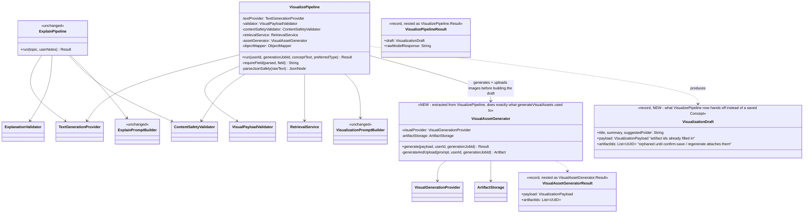

**Where the persistence responsibility went**: `VisualizeJobHandler`
(Section 1.5) now owns the decision of *what to do* with the pipeline's
output — store it as a draft on the job's `result_payload`
(`VisualizationDraftCodec`), or append it as a new version to an
already-saved concept (`ConceptRegenerationService`, Section 1.4). The
pipeline itself makes that decision for neither case — a clean example of
moving a decision out of the class that used to make it implicitly.

**Worth noting since it closes the loop on earlier feedback**: the
previous version of this document flagged `VisualizePipeline`'s 10
dependencies as an SRP tension and named persistence/asset-generation
extraction as the natural fix "if this module ever needs splitting
further." That's exactly what happened here.

---

### 1.8 Generation / Model — the typed payload hierarchy (sealed interface)

```mermaid
classDiagram
    class VisualizationPayload {
        <<sealed interface>>
        +type() String
        +version() int
    }
    class MindMapPayload {
        <<record>>
        +version: int
        +rootLabel: String
        +nodes: List~Node~
        +edges: List~Edge~
        +layoutHints: LayoutHints
        +citations: List~Citation~
        +type() String
    }
    class Node { <<record, nested>> +id +label +detail }
    class Edge { <<record, nested>> +sourceId +targetId +relationshipLabel }
    class LayoutHints { <<record, nested>> +orientation +rootNodeId }
    class Citation { <<record, nested>> +nodeId +sourceText }
    class DiagramPayload {
        <<record>>
        +version: int
        +elements: List~Element~
        +connections: List~Connection~
        +type() String
    }
    class Element { <<record, nested>> +id +elementType +label +x +y +width +height +style +accessibilityLabel }
    class Connection { <<record, nested>> +id +sourceId +targetId +label +style }
    class AnimationPayload {
        <<record>>
        +version: int
        +scenes: List~Scene~
        +type() String
    }
    class Scene { <<record, nested>> +id +order +title +narration +durationSeconds +transitionToNext +needsVisualAsset +visualPrompt +assetArtifactIds }
    class ImagePayload {
        <<record>>
        +version: int
        +imagePrompt: String
        +artifactId: String
        +altText: String
        +type() String
    }
    class ExplanationPayload {
        <<record, NOT part of the sealed hierarchy - separate concern>>
        +version: int
        +suggestedTitle: String
        +overview: String
        +sections: List~Section~
    }
    class Section { <<record, nested>> +heading +type +body +bullets }

    VisualizationPayload <|.. MindMapPayload
    VisualizationPayload <|.. DiagramPayload
    VisualizationPayload <|.. AnimationPayload
    VisualizationPayload <|.. ImagePayload
    MindMapPayload *-- Node
    MindMapPayload *-- Edge
    MindMapPayload *-- LayoutHints
    MindMapPayload *-- Citation
    DiagramPayload *-- Element
    DiagramPayload *-- Connection
    AnimationPayload *-- Scene
    ExplanationPayload *-- Section
```

**Pattern**: this is a closed-world **sum type** (Java sealed interface),
the modern alternative to the GoF Visitor pattern for "a fixed set of
variants, exhaustively handled." `VisualPayloadValidator` and every
frontend renderer switch on `type()` — the compiler (and, on the
frontend, a runtime dispatch table) both benefit from the type being
closed to exactly four variants, permits-listed on the interface itself.
`ExplanationPayload` deliberately isn't part of this hierarchy — it's a
different concern (explaining vs. visualizing) with no shared shape.

---

### 1.9 Generation / Validation — the hard trust boundary on AI output

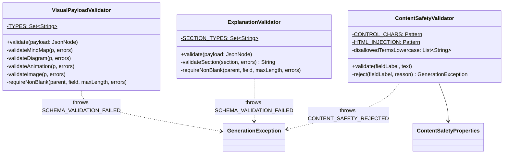

**Pattern**: all three are stateless, single-method-purpose validators —
not a shared base class or interface, deliberately. They validate
*structurally different* things (a discriminated-union payload, a fixed
shape with a business-rule requirement, and plain-text safety), so a
forced common `Validator<T>` interface would buy uniformity without
buying substitutability (nothing ever treats them polymorphically). This
is a good example of *not* over-applying DIP where it doesn't pay for
itself.

---

### 1.10 RAG — server-side retrieval-augmented generation

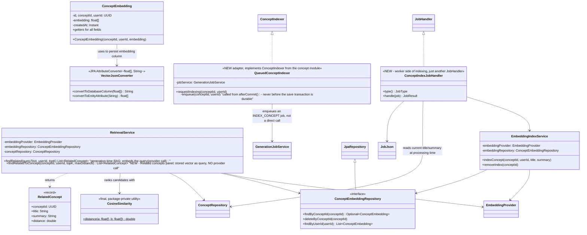

**Decision confirmed by the user 2026-09-27**: the related-concepts read uses
the concept's **stored** embedding (already `embed(title + ". " + summary)`)
plus a configurable distance cut-off, so opening a concept never calls an AI
provider from the api process. `findRelated` is unchanged and still serves
generation.

**Architectural note this diagram makes obvious**: `RetrievalService` and
`EmbeddingIndexService` are a clean **CQRS-flavored split** (not full
CQRS, just the read/write separation part of it) — one only ever reads
and ranks, the other only ever writes. Neither depends on the other.
`CosineSimilarity` is intentionally package-private and static-only: it's
pure math with no state, no reason to be part of any object's public
surface.

---

### 1.11 Storage — S3-backed artifact lifecycle

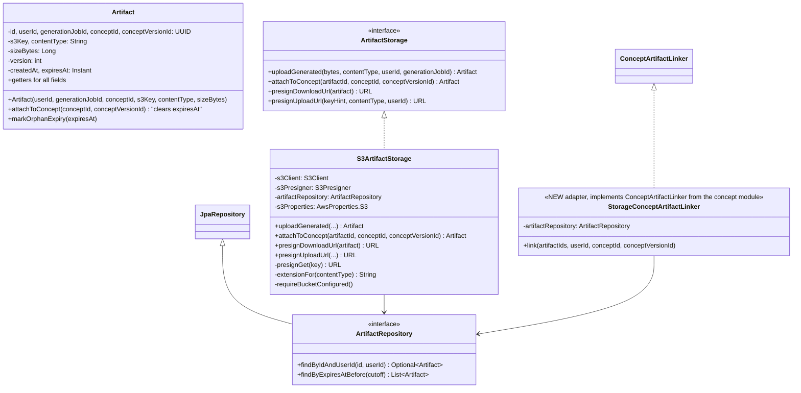

**Pattern**: `ArtifactStorage` is a single-implementation interface today
— arguably "unnecessary" abstraction by a narrow YAGNI reading, but it's
the explicit seam for the roadmap's later concern (a different storage
backend, or local disk for a dev/test profile) and it's what lets
`VisualizePipeline` never import an AWS SDK class directly. This is a
defensible DIP application even with one implementation, because the
volatile thing (the concrete storage mechanism) is exactly what's being
isolated.

---

### 1.12 Rate limiting — distributed, Redis-backed

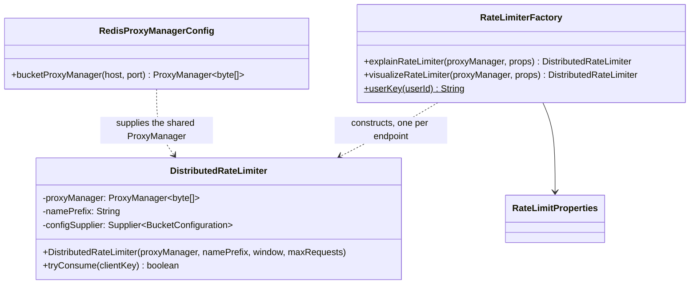

**Note**: keyed by **authenticated user id**, not IP — a deliberate choice
since the abuse/cost boundary that matters for paid AI calls is "this
user," and IP-keying would incorrectly throttle unrelated users behind
shared IPs (offices, campus networks, carrier-grade NAT) together.

---

### 1.13 Web — controllers, DTOs, cross-cutting response handling

```mermaid
classDiagram
    class GlobalExceptionHandler {
        +handleDuplicateTitle(DuplicateTitleException) ResponseEntity "409 DUPLICATE_TITLE"
        +handleDraftNotSaveable(DraftNotSaveableException) ResponseEntity "409 DRAFT_NOT_READY / 410 DRAFT_EXPIRED"
        +handleNotFound(NotFoundException) ResponseEntity
        +handleForbidden(ForbiddenException) ResponseEntity
        +handleAccessDenied(AccessDeniedException) ResponseEntity
        +handleValidation(MethodArgumentNotValidException) ResponseEntity
        +handleUnreadable(HttpMessageNotReadableException) ResponseEntity
        +handleMethodNotAllowed(HttpRequestMethodNotSupportedException) ResponseEntity
        +handleGeneration(GenerationException) ResponseEntity
        +handleUnexpected(Exception) ResponseEntity
    }
    class ResponseMapper {
        -objectMapper: ObjectMapper
        +toJobResponse(GenerationJob) JobResponse
        +toConceptResponse(Concept) ConceptResponse
        +toConceptVersionSummaryResponse(ConceptVersion) ConceptVersionSummaryResponse
        +toConceptVersionResponse(ConceptVersion) ConceptVersionResponse
        +toRelatedConceptResponse(RelatedConcept) RelatedConceptResponse
        -parseOrNull(json) JsonNode
    }
    class AccountController {
        +get() AccountResponse
        +updateProfile(ProfileUpdateRequest) AccountResponse
        +requestDeletion() AccountResponse
        +cancelDeletion() AccountResponse
    }
    class ArtifactController {
        +getDownloadUrl(id) ArtifactDownloadResponse
    }
    class ConceptController {
        +list(folder) List~ConceptResponse~
        +save(ConceptSaveRequest) ResponseEntity~ConceptResponse~ "NEW - confirm-save, 201/200/409/410"
        +sparkFeed(folder, excludeIds, limit) List~ConceptResponse~ "NEW - Spark feed backend groundwork"
        +folders() List~String~ "NEW - Folders backend groundwork (distinct strings, not entities)"
        +get(id) ConceptResponse
        +versions(id) List~ConceptVersionSummaryResponse~ "NEW"
        +version(id, version) ConceptVersionResponse "NEW"
        +rename(id, ConceptRenameRequest) ConceptResponse
        +delete(id) ResponseEntity~Void~
    }
    class RelatedConceptController {
        <<NEW - Phase 6, own controller by user decision 2026-09-27>>
        +related(id, limit?, maxDistance?) List~RelatedConceptResponse~ "GET /api/concepts/:id/related"
    }
    class ExplainController {
        +explain(ExplainRequest) ResponseEntity
    }
    class GenerationJobController {
        +getJob(id) JobResponse
    }
    class VisualizeController {
        +visualize(VisualizeRequest) ResponseEntity~?~ "conceptId in the request now means regenerate, not a new field elsewhere"
    }

    class ExplainRequest { -topic -userNotes : String }
    class VisualizeRequest {
        -conceptText -preferredVisualizationType : String
        -sourceExplainJobId, conceptId : UUID
        +isConceptTextPresentUnlessRegenerate() boolean "NEW - cross-field @AssertTrue: text required unless this is a regenerate"
    }
    class ConceptSaveRequest {
        <<NEW>>
        -jobId: UUID
        -title, folder: String "optional overrides"
        -onDuplicate: String "@Pattern REJECT|KEEP_BOTH|REPLACE, mapped to DuplicateTitlePolicy in the controller"
    }
    class ConceptRenameRequest { -title : String }
    class ProfileUpdateRequest { -email -displayName : String }
    class AccountResponse { <<record>> +id +email +displayName +deletionPending +deletionEffectiveAt }
    class ConceptResponse { <<record>> +id +title +summary +folder +visualizationType +visualization +currentVersion +createdAt +updatedAt }
    class ConceptVersionSummaryResponse { <<record, NEW>> +version +title +createdAt }
    class ConceptVersionResponse { <<record, NEW>> +version +title +summary +visualizationType +visualization +createdAt }
    class JobResponse { <<record>> +id +jobType +status +resultPayload +conceptId +errorMessage +createdAt +updatedAt }
    class ArtifactDownloadResponse { <<record>> +downloadUrl +expiresAt }
    class RelatedConceptResponse { <<record, NEW>> +id +title +summary +distance }

    AccountController --> CurrentUserService
    AccountController --> DataDeletionService
    AccountController --> UserProvisioningService
    ArtifactController --> ArtifactRepository
    ArtifactController --> ArtifactStorage
    ArtifactController --> CurrentUserService
    ConceptController --> ConceptService
    ConceptController --> ConceptSaveService : NEW dependency
    ConceptController --> EmbeddingIndexService : delete removes the embedding
    ConceptController --> CurrentUserService
    ConceptController --> ResponseMapper
    ExplainController --> GenerationJobService
    ExplainController --> DistributedRateLimiter
    GenerationJobController --> GenerationJobService
    GenerationJobController --> CurrentUserService
    RelatedConceptController --> ConceptService : ownership check
    RelatedConceptController --> RetrievalService
    RelatedConceptController --> RelatedConceptsProperties
    RelatedConceptController --> CurrentUserService
    RelatedConceptController --> ResponseMapper
    GenerationJobController --> ResponseMapper
    VisualizeController --> GenerationJobService
    VisualizeController --> ConceptService : NEW - synchronous ownership check on regenerate before enqueueing
    VisualizeController --> DistributedRateLimiter
    VisualizeController --> CurrentUserService
    VisualizeController --> ResponseMapper
    ResponseMapper ..> JobResponse
    ResponseMapper ..> ConceptResponse
    ResponseMapper ..> ConceptVersionSummaryResponse
    ResponseMapper ..> ConceptVersionResponse
    ResponseMapper ..> RelatedConceptResponse
```

**A real, deliberate correctness detail worth naming**: `VisualizeController`
now checks ownership of `conceptId` **synchronously, before enqueueing**,
for the regenerate path. Without that check, a cross-tenant or bogus
`conceptId` would 202-accept successfully and only fail later, invisibly,
inside the worker — the user would just see a job that mysteriously never
completes. Checking synchronously means a bad id 404s immediately instead.

**One real bug found during implementation, correctly flagged rather than
hidden** (from the project's own `docs/VERIFY_PHASE_A_B.md`): `JobProcessingService.process`
runs a whole job inside one transaction. If a `@Transactional` method it
calls throws (e.g. `EmbeddingIndexService.indexConcept` failing), Spring
marks that transaction rollback-only — the job then can't even be marked
FAILED, so SQS keeps redelivering it until the DLQ. Pre-existing before
this change, not introduced by it, and explicitly deferred rather than
silently left as a surprise. Tracked in the roadmap now as real tech
debt, not lost.

**Pattern**: every controller is thin — request in, service call, DTO
out, no business logic. `ResponseMapper` is the one place entity→DTO
translation happens, so it doesn't get duplicated per controller.
`GlobalExceptionHandler` is a textbook **Chain of Responsibility** at the
framework level (Spring tries each `@ExceptionHandler` for a match) —
worth naming explicitly since it's a real pattern application, not just
"error handling code."

---

**Phase 7 additions to the web layer (2026-09-28)**: `FolderController`
(`/api/folders`: list with counts, create, rename/recolour, delete with a
required `?concepts=unfile|delete`) and `ConceptFolderController`
(`PUT /api/concepts/{id}/folder`, plus the legacy `GET /api/concepts/folders`,
moved here from `ConceptController` with the same contract).
`ConceptResponseAssembler` adds each concept's folder label (one folder query
per list), so `ConceptController` now maps through it; `ResponseMapper` gained
`toFolderResponse` and `toConceptResponse(Concept, FolderLabel)`.
`GlobalExceptionHandler` maps `DuplicateFolderNameException` → 409
`DUPLICATE_FOLDER_NAME` and `InvalidFolderRequestException` → 400.

### 1.14 BUILT — Phase 7 (Folders). Phase 6 (RAG Surfaced) is BUILT

**Phase 6 is no longer planned**: it shipped as `RelatedConceptController` +
`RetrievalService.findRelatedToConcept` + `RelatedConceptResponse(id, title,
summary, distance)` + `RelatedConceptsProperties` (see 1.2, 1.10 and 1.13).
It differs from the sketch that used to be here in three ways, **all confirmed
by the user on 2026-09-27**: (1) its own controller, not a method on
`ConceptController`; (2) the stored embedding as the query, not
`findRelated(title + summary)`; (3) a configurable distance cut-off. The DTO
includes `distance`, as the roadmap's step 2 specified.

Folders are **built** (2026-09-28, `feature/phase-7-folders`), as below.
Design and decisions: `backend/docs/design/phase-7-folders.md`. Differences
from the sketch that used to be here, all approved by the user: no JPA link
from `Concept` to `Folder` (id only, so `concept` never imports `folder`);
names compared by the column's `utf8mb4_0900_as_ci` collation instead of
`IgnoreCase`; reads split into `FolderQueryService`; one adapter per port
(a combined one would form a startup cycle); and a `FolderDeletionMode`.

```mermaid
classDiagram
    direction LR
    namespace concept {
        class Concept {
            -folderId: UUID "null = unfiled"
            +moveToFolder(folderId)
        }
        class FolderAssigner {
            <<interface, port>>
            +findOrCreate(userId, name) Optional~UUID~
        }
        class FolderLookup {
            <<interface, port>>
            +findIdByName(userId, name) Optional~UUID~
            +isOwnedBy(folderId, userId) boolean
        }
        class ConceptFolderStats {
            <<interface, published>>
            +countByFolder(userId) Map~UUID, Long~
        }
        class ConceptFolderContents {
            <<interface, published>>
            +deleteAllInFolder(userId, folderId) int
        }
        class ConceptFolderStatsQuery
        class ConceptService {
            +listForUser(userId, folderName)
            +randomSparkFeed(userId, folderName, excludeIds, limit)
            +moveOwnedConcept(conceptId, userId, folderId) Concept
            +deleteAllInFolder(userId, folderId) int
        }
        class ConceptSaveService {
            -resolveFolderId(userId, draft, override) UUID
        }
    }
    namespace folder {
        class Folder {
            <<entity>>
            -id, userId: UUID
            -name: String
            -color: FolderColor
            +rename(name)
            +recolor(color)
            +normalizeName(raw) String$
        }
        class FolderColor {
            <<enumeration>>
            CORAL
            YELLOW
            TEAL
            SKY
            VIOLET
            ROSE
            GREEN
            SLATE
        }
        class FolderColorConverter
        class FolderRepository {
            <<interface>>
        }
        class FolderColorAssigner {
            <<interface>>
            +nextColor(userId) FolderColor
        }
        class LeastUsedFolderColorAssigner
        class FolderService {
            +createFolder(userId, name, color) Folder
            +renameOrRecolor(folderId, userId, name, color) Folder
            +deleteOwnedFolder(folderId, userId, mode)
            +findOrCreateByName(userId, name) Optional~Folder~
        }
        class FolderQueryService {
            +listForUser(userId) List~FolderSummary~
            +summaryFor(folder) FolderSummary
            +labelsFor(userId) Map~UUID, FolderLabel~
            +labelFor(userId, folderId) Optional~FolderLabel~
            +namesWithConcepts(userId) List~String~
            +findIdByName(userId, name) Optional~UUID~
            +isOwnedBy(folderId, userId) boolean
        }
        class FolderDeletionMode {
            <<enumeration>>
            UNFILE
            DELETE_CONCEPTS
        }
        class FolderAssignerAdapter
        class FolderLookupAdapter
    }
    ConceptSaveService --> FolderAssigner
    ConceptService --> FolderLookup
    ConceptFolderContents <|.. ConceptService
    ConceptFolderStats <|.. ConceptFolderStatsQuery
    FolderAssigner <|.. FolderAssignerAdapter
    FolderLookup <|.. FolderLookupAdapter
    FolderAssignerAdapter --> FolderService
    FolderLookupAdapter --> FolderQueryService
    FolderService --> FolderRepository
    FolderService --> FolderColorAssigner
    FolderService --> ConceptFolderContents : DELETE_CONCEPTS only
    FolderService ..> FolderDeletionMode
    FolderColorAssigner <|.. LeastUsedFolderColorAssigner
    LeastUsedFolderColorAssigner --> FolderRepository
    FolderQueryService --> FolderRepository
    FolderQueryService --> ConceptFolderStats : counts
    Folder --> FolderColor
    Folder ..> FolderColorConverter : stored as key
```

**Note on Audio (Phase 10) not appearing here yet**: no new storage
entity is needed for it — the existing `Artifact` table is already
generic (an S3 key + content type + owning concept/job), so an audio
narration file is just another `Artifact` row with `content_type =
audio/mpeg` or similar. The real new work for Audio is a
`NarrationProvider` interface mirroring `TextGenerationProvider`'s shape
— deliberately not sketched in detail here since that phase is still two
phases out and the exact interface shape isn't locked yet. Worth noting
now specifically so nobody re-derives "do we need a new table for audio"
later and gets it wrong — you don't.

---

## 2. Database Schema (ER Diagram)

Solid lines/boxes = live today, verified against the actual uploaded
code. "PLANNED" labels = still planned (review history for Spark's
due-for-review mode). Concept versioning and folders (Phase 7, V3), both
previously shown as planned here, are real; see Sections 1.4 and 1.14.

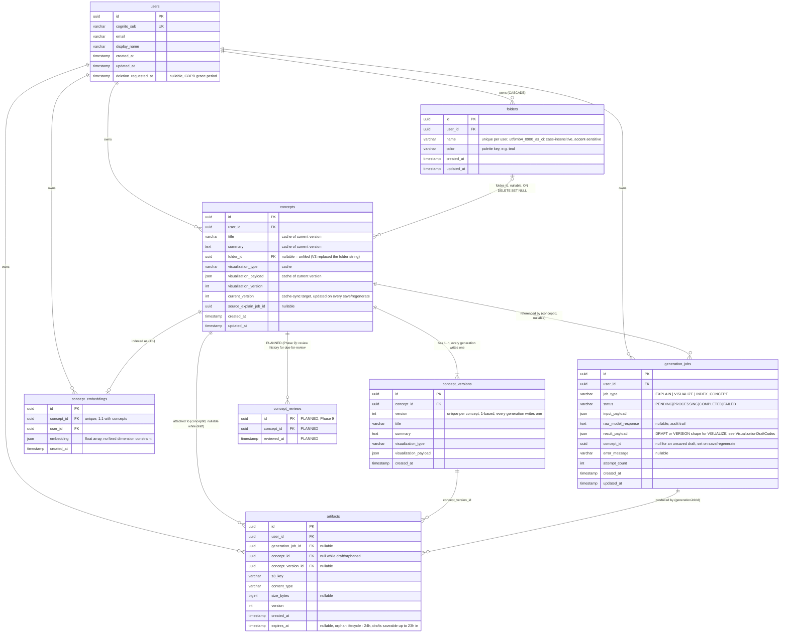

**Cardinality notes worth stating explicitly**:
- `users : concepts/jobs/artifacts/embeddings` — one-to-many, every one
  of them, and every one cascades on user delete (this is what makes the
  GDPR hard-delete a single `DELETE FROM users` and nothing else).
- `concepts : concept_embeddings` — **one-to-one**, not one-to-many. A
  future chunking strategy (multi-paragraph concepts needing multiple
  embedding vectors) is the one thing that would break this cardinality —
  flagged in the code comments already, not a surprise if it happens.
- `concepts : concept_versions` — **verified real, not planned anymore**
  — one-to-many, and every concept has **at least one** version (the
  first generation is version 1, not a special case) — this is a
  business rule the schema itself can't enforce (no "at least 1"
  constraint in SQL for a child table), so it's enforced in
  `ConceptSaveService` instead (Section 1.4).
- `folders : concepts` (built, V3) — one-to-many; `folder_id` is
  **nullable** (a concept doesn't have to belong to a folder), matching the
  vision's "unstructured, not a forced hierarchy". Deleting a folder sets its
  concepts' `folder_id` to NULL unless the user chose to delete them too.
- `concepts : concept_reviews` (planned, Phase 9) — one-to-many, a full
  history table rather than a single `last_reviewed_at` column on
  `concepts`. Deliberate: the vision doc's due-for-review algorithm is
  explicitly undecided yet ("fixed intervals, exponential spacing, or
  something simpler"), and a full history is what keeps every one of
  those algorithm choices *possible* later without a second migration —
  a single timestamp column would only support the simplest version and
  would need to be replaced, not extended, if the algorithm needs more
  than "time since last seen."

---

## 3. Stakeholder-Facing Diagram (Use Case Diagram)

Mermaid has no native UML use-case notation (no actor stick-figures, no
ellipses) — this is the standard flowchart-based approximation used when
that's the case. Intentionally excludes all technical detail (no
mention of Spring, MySQL, SQS, etc.) — this is for a non-technical
audience to understand *what the product does*, not how.

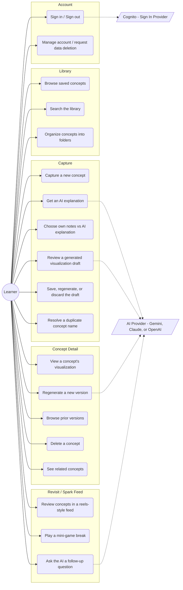

**Status legend for stakeholders reading this** (not part of formal UML,
added because it's directly useful here; updated 2026-09-27): UC1–UC9,
UC12–UC16 are **built** (UC16 related concepts is waiting on its real-data
product check and uses no AI call at view time; saved concepts were embedded
once, at save). UC10 search and UC11 folders are **built** (Phase 7, awaiting the user's run). UC17–UC18 are
**partly built** (a real reels-style feed of saved animations with two
mini-games; the teaser/reveal, gestures and three modes aren't built).
UC19 is not built.

---

## How to keep this from going stale

Regenerate the class-diagram section the same way it was built — grep the
real source tree for class/field/method declarations — rather than
hand-editing it after a large change. The schema section should be
updated the moment a new Flyway migration lands, not batched up. This
document is only useful as long as it's trusted to be current; treat a
stale version of it as worse than no diagram at all.

---

## Visual failsafe (added 2026-10-06)

Full design: `backend/docs/design/visual-failsafe-and-provider-routing.md`. `generation.fallback` depends only on `generation.model` and `generation.validation`; nothing outside `generation.pipeline` calls it.

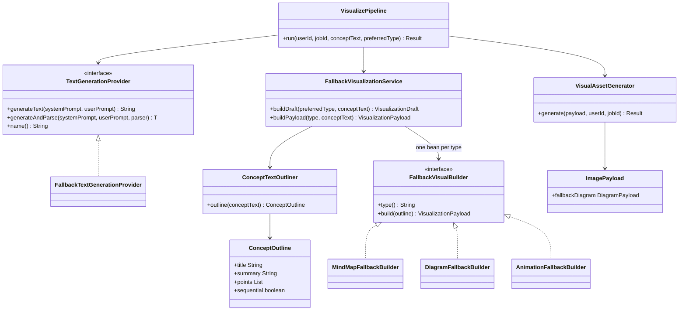
